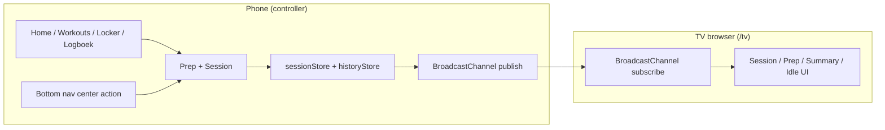
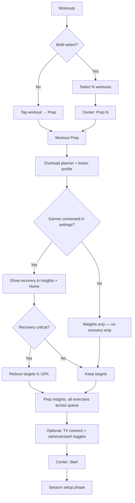
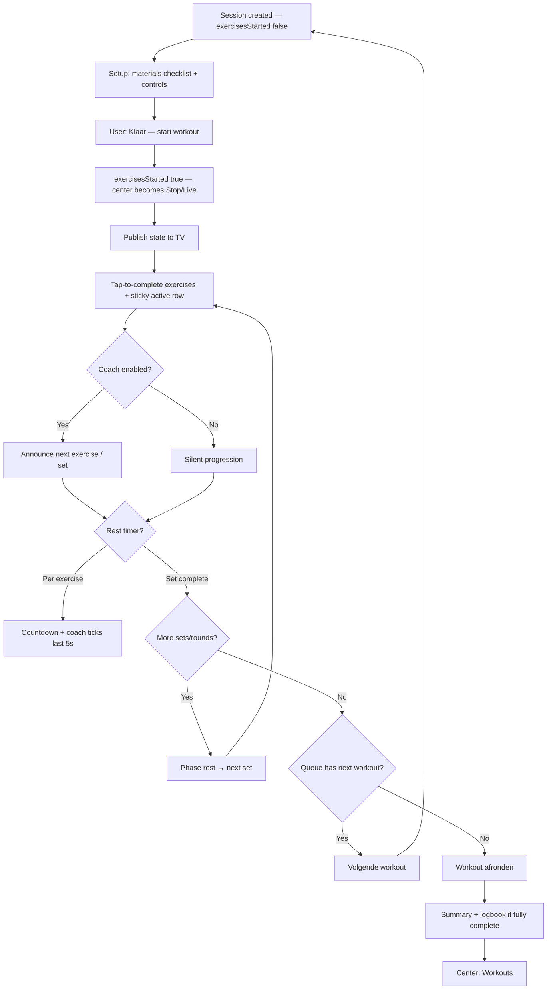
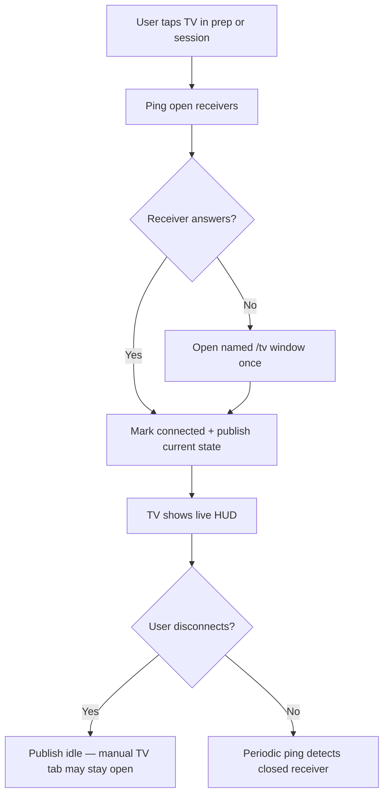
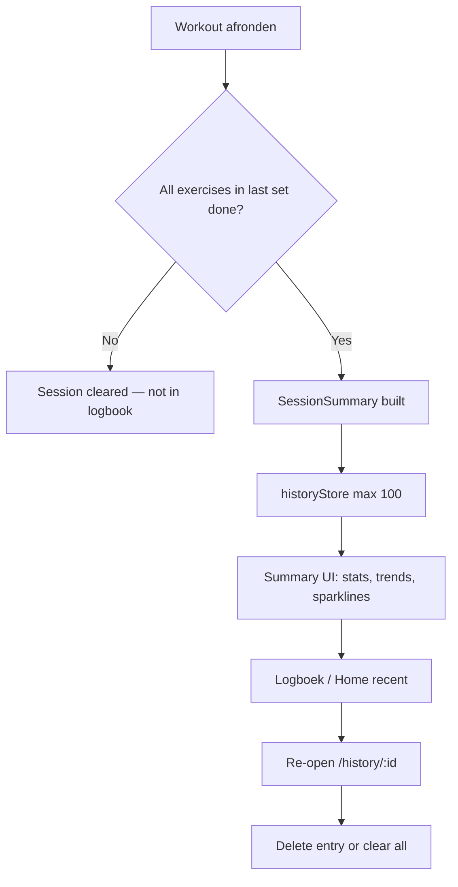

# User Flows & Architecture

How SOLO. is structured today — controller vs TV receiver, session lifecycle, navigation, and on-device storage. Product pillars and **Now / Next** scope: **[README.md](README.md#the-5-pillars-of-solo)**. Planned phases: **[ROADMAP.md](ROADMAP.md)**.

---

## System overview

The phone is the **controller**; the TV is an optional **receiver**. Persistent state lives in `localStorage` (with a few `sessionStorage` keys for ephemeral prep/queue/summary). The TV page subscribes to a `BroadcastChannel` and renders the latest message — no backend, no account.



| Surface | Route | Role |
|---|---|---|
| Mobile shell | `/`, `/workouts`, `/locker`, `/history` | Controller — home, templates, locker, logbook |
| Workout prep | `/workouts/prep?ids=…` | Targets, insights, TV connect, queue |
| Live session | `/session` | Active workout controller |
| Summary | `/session/summary` or `/history/:id` | Post-workout or historical recap |
| TV receiver | `/tv` | Passive display — open on TV or cast this tab |
| Labs | `/lab/*` | Architecture experiments (not main flow) |

---

## Bottom navigation — center action

The bottom bar has four tabs (Home, Workouts, Locker, Logboek) plus a **center action** button. Its label, icon, and enabled state depend on context (`centerNavState.ts` + `useWorkoutSelection`).

| Context | Center button | Enabled? |
|---|---|---|
| Home / Locker / Logboek, no session, multi-select off | Muted (no label) | No |
| Workouts, multi-select off | Muted | No |
| Workouts, multi-select on, 0 selected | **Kies** | No |
| Workouts (or any tab), multi-select on, N selected | **Prep N** | Yes → prep |
| Workout prep | **Start** | Yes → opens session (setup phase) |
| Session, setup (materials not confirmed) | **Voorbereiden** | On session: no; elsewhere: back to session |
| Session, exercises running, on `/session` | **Stop** | Yes (confirm + cancel) |
| Session, exercises running, elsewhere | **Live** | Yes → session |
| Summary after finish | **Workouts** | Yes → workouts list |

Multi-select state is global (`useWorkoutSelection`) so a prep count can persist while switching tabs.

---

## Pre-workout flow



Prep shows per-exercise targets, optional weight-assistant plates, and tappable rows that open an **exercise info modal** (mobile visual + description). Multi-workout queues are stored in `sessionStorage` until the last workout finishes.

---

## Live session flow



Completed exercises sink to the bottom of the list; **Ongedaan** can undo a mistaken tap. Exercise rows open the same info modal as prep. Audio notes show a visible recording state while the mic is held.

Cancelled or incomplete sessions are cleared without a history entry.

---

## TV connect flow



HR / recovery on the TV sensor strip is gated on **Garmin connected** (settings toggle). Coach and camera flags travel with session TV state.

---

## Post-workout & logbook



---

## Data stores (implemented)

### localStorage (`localStore` — stable snapshot cache)

| Key | Contents |
|---|---|
| `solo-workouts` | Workout templates |
| `solo-lockers` | Locker profiles + equipment items |
| `solo-active-session` | In-progress session (`exercisesStarted`, pause, notes, …) |
| `solo-history` | Completed session records + full summaries |
| `solo-recovery-score` | Manual recovery % (mock until Health API) |
| `solo-garmin-connected` | Settings toggle — shows recovery UI when on |
| `solo-coach-enabled` / `solo-coach-voice-gender` | Coach prefs |
| `solo-camera-enabled` | Camera preview preference |
| `solo-theme` | Theme preference |
| `solo-auto-translate-wger` | Wger auto-translate |

### sessionStorage (ephemeral)

| Key | Contents |
|---|---|
| `solo-session-prep` | Last prep payload |
| `solo-workout-queue` | Remaining workouts in multi-session |
| `solo-last-summary` | Transient summary after finish |

### TV transport

| Channel | Role |
|---|---|
| `solo-tv-sync` | Session / prep / summary / idle payloads |
| Control ping/pong | Receiver handshake + connection status |

---

## Project layout

```
src/
  pages/              # Route screens (Home, Workouts, Prep, Session, Logboek, TV, labs)
  components/
    layout/           # BottomNav, centerNavState, PageBackButton
    session/          # Controls, rest bar, materials checklist, summary
    workout/          # Builder, cards, PrepInsightsPanel, ExerciseInfoModal, …
    locker/
  hooks/              # useActiveSession, useWorkoutSelection, useGarminConnected, …
  lib/
    storage/          # localStore + domain stores
    tv/               # broadcast, transport, coachEngine, exerciseMedia
    workout/          # overload planner, session prep/queue, summary, Wger import
    wger/
  config/             # nav, labs registry
```

---

*Pillar vision and future work: **[ROADMAP.md](ROADMAP.md)** · Product overview: **[README.md](README.md)**.*
