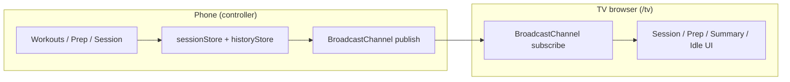
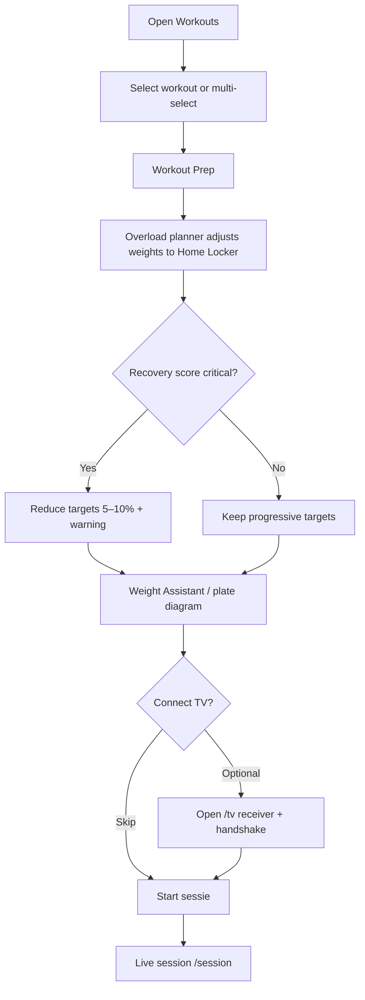
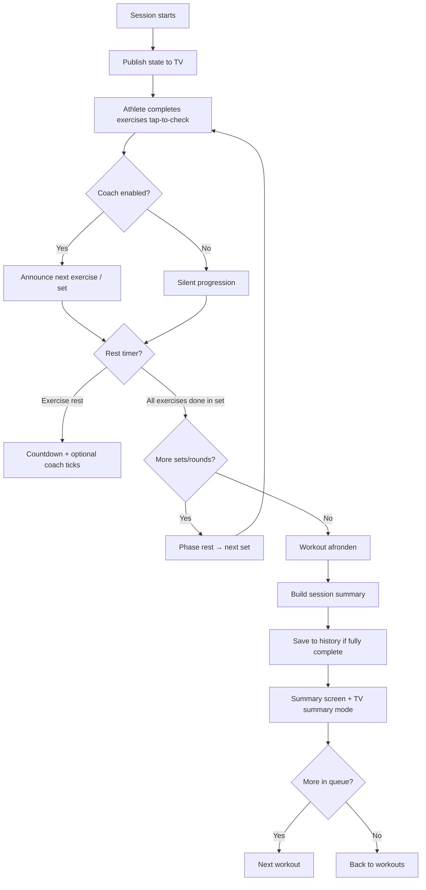
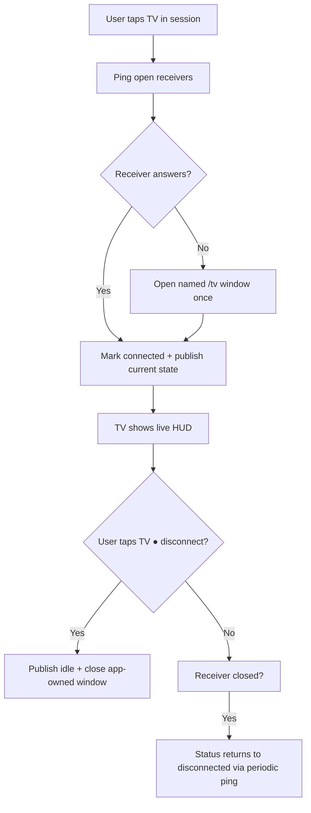
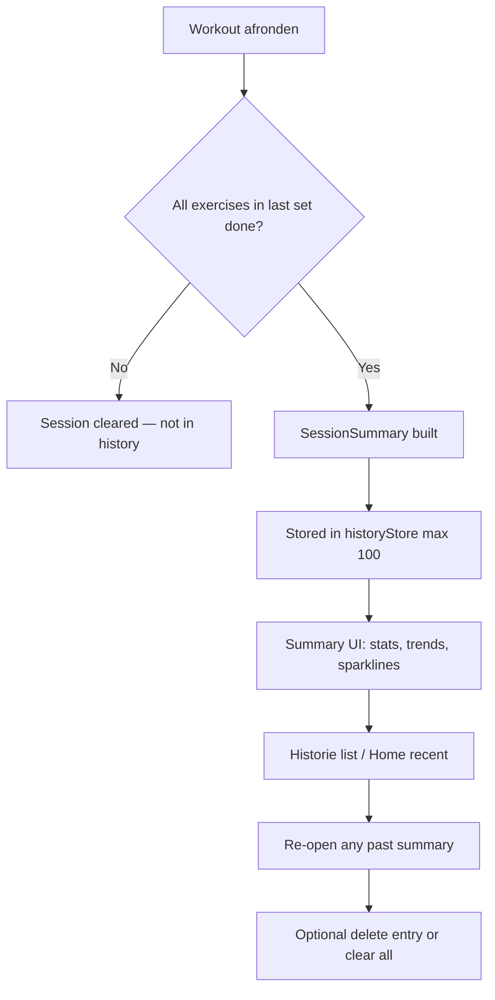

# User Flows & Architecture

How SOLO. is structured today — controller vs TV receiver, session lifecycle, and on-device storage. For planned pillars and future flows (Garmin, pose, WebLLM), see **[ROADMAP.md](ROADMAP.md)**.

---

## System overview

The phone is the **controller**; the TV is an optional **receiver**. Session state lives in `localStorage`. The TV page subscribes to a broadcast channel and renders the latest message — no backend.



## Pre-workout flow



## Live session flow



## TV connect flow



## Post-workout & history



## Data stores (implemented)

| Key | Contents |
|---|---|
| `solo-workouts` | Workout templates |
| `solo-locker` | Locker profiles + equipment items |
| `solo-active-session` | In-progress session |
| `solo-history` | Completed session records + full summaries |
| `solo-recovery-score` | Manual recovery % (mock until Health API) |
| `solo-coach` | Coach enabled + voice gender prefs |
| `solo-theme` | Theme preference |

## Project layout

```
src/
  pages/           # Route-level screens (session, prep, TV, history, labs)
  components/      # UI (session controls, workout builder, TV overlays)
  hooks/           # useActiveSession, useTvConnection, useHistory, …
  lib/
    storage/       # localStore + domain stores
    tv/            # broadcast, transport, coach engine
    workout/       # overload planner, session summary, Wger import
    wger/          # API client
  config/          # nav, labs registry
```
