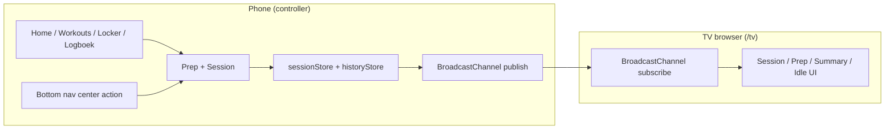
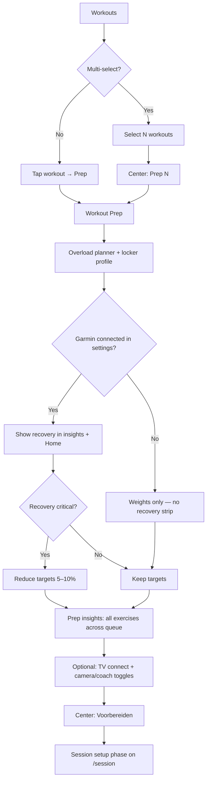
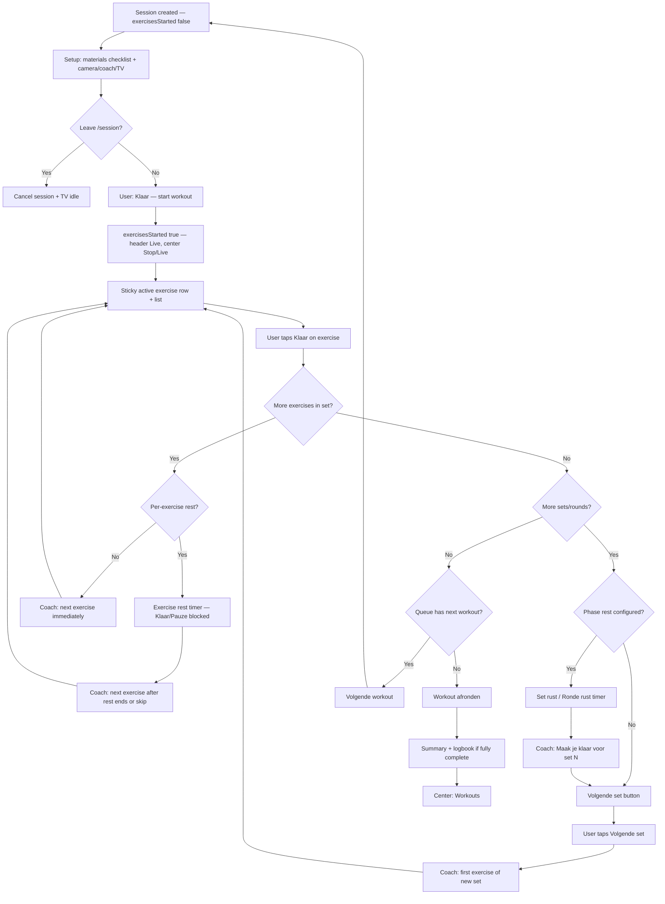
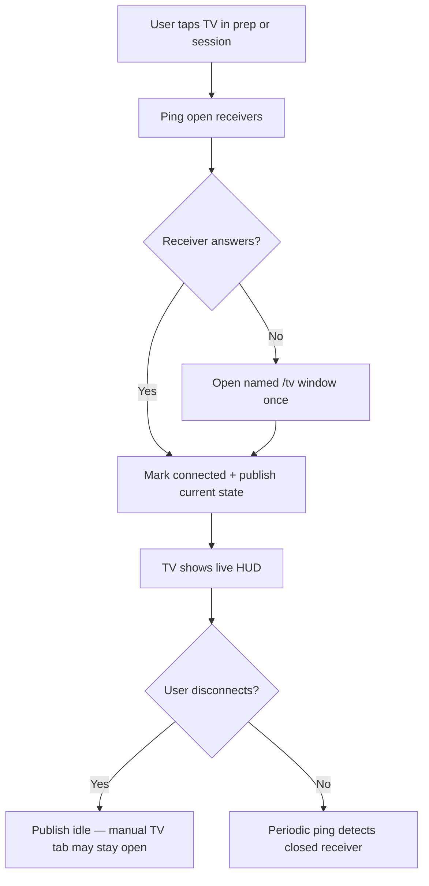
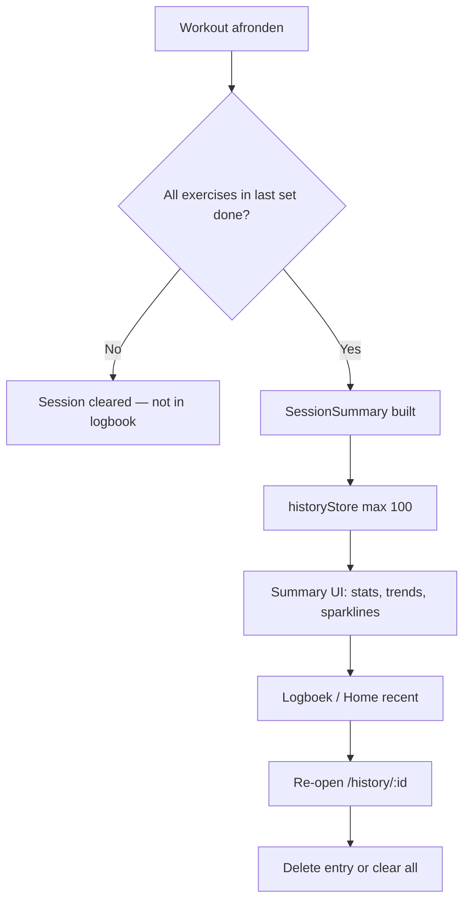

# User Flows & Architecture

How SOLO. is structured today — controller vs TV receiver, session lifecycle, navigation, and on-device storage. Product pillars and **Now / Next** scope: **[README.md](README.md#the-5-pillars-of-solo)**. Planned phases: **[ROADMAP.md](ROADMAP.md)**.

---

## System overview

The phone is the **controller**; the TV is an optional **receiver**. Persistent state lives in `localStorage` (with a few `sessionStorage` keys for ephemeral prep/queue/summary). The TV page subscribes to a `BroadcastChannel` and renders the latest message — no backend, no account.


```mermaid
graph LR
  subgraph Phone["Phone (controller)"]
    A[Home / Workouts / Locker / Logboek]
    B[Prep + Session]
    C[sessionStore + historyStore]
    D[BroadcastChannel publish]
    E[Bottom nav center action]
  end
  subgraph TV["TV browser (/tv)"]
    F[BroadcastChannel subscribe]
    G[Session / Prep / Summary / Idle UI]
  end
  A --> B
  B --> C
  C --> D
  D --> F
  F --> G
  E --> B
```

| Surface | Route | Role |
|---|---|---|
| Mobile shell | `/`, `/workouts`, `/locker`, `/history` | Controller — home, templates, locker, logbook |
| Workout prep | `/workouts/prep?ids=…` | Targets, insights, TV connect, queue |
| Live session | `/session` | Active workout controller |
| Summary | `/session/summary` or `/history/:id` | Post-workout or historical recap |
| TV receiver | `/tv` | Passive display — open on TV or cast this tab |
| Labs | `/lab/*` | Architecture experiments (not main flow) |

---

## Bottom navigation — center action

The bottom bar has four tabs (Home, Workouts, Locker, Logboek) plus a **center action** button. Its label, icon, and enabled state depend on context (`centerNavState.ts` + `useWorkoutSelection`). When idle, the center shows the muted **SOLO** logo mark (`icon: 'solo'`).

| Context | Center button | Enabled? |
|---|---|---|
| Home / Locker / Logboek / Workouts, no session, multi-select off | Muted SOLO icon | No |
| Workouts, multi-select on, 0 selected | **Kies** | No |
| Workouts (or any tab), multi-select on, N selected | **Prep N** | Yes → prep |
| Workout prep (targets ready) | **Voorbereiden** | Yes → creates session in setup phase, navigates to `/session` |
| Workout prep (not ready) | Muted SOLO icon | No |
| Session, setup (`exercisesStarted` false), on `/session` | **Voorbereiden** (disabled) | No — workout starts only via **Klaar — start workout** on the page |
| Session, setup, elsewhere | Muted SOLO icon | No — leaving `/session` during setup **cancels** the session (`useCancelSetupOnLeave`) |
| Session, exercises running, on `/session` | **Stop** | Yes (confirm + cancel) |
| Session, exercises running, elsewhere | **Live** | Yes → session |
| Summary after finish | **Workouts** | Yes → workouts list |

Home shows **Sessie bezig** only when exercises have actually started (`exercisesStarted`), not during the setup phase.

Multi-select state is global (`useWorkoutSelection`) so a prep count can persist while switching tabs.

### Sticky page headers

Prep and session screens share `PageStickyHeader` — a sticky bar below the app header with back arrow, title, and optional icon actions.

| Screen | Title | Accent |
|---|---|---|
| Workout prep | `Voorbereiden · {workout}` | `text-warn` |
| Session setup | `Voorbereiden · {workout}` | `text-warn` |
| Live session | `Live · {workout} · Set N/M` | `text-success` |
| Workout editor | Workout name | default (+ save / Wger / add actions) |

---

## Pre-workout flow


```mermaid
graph TD
  A[Workouts] --> B{Multi-select?}
  B -- No --> C[Tap workout → Prep]
  B -- Yes --> D[Select N workouts]
  D --> E[Center: Prep N]
  C --> F[Workout Prep]
  E --> F
  F --> G[Overload planner + locker profile]
  G --> H{Garmin connected in settings?}
  H -- Yes --> I[Show recovery in insights + Home]
  H -- No --> J[Weights only — no recovery strip]
  I --> K{Recovery critical?}
  K -- Yes --> L[Reduce targets 5–10%]
  K -- No --> M[Keep targets]
  J --> M
  L --> N[Prep insights: all exercises across queue]
  M --> N
  N --> O[Optional: TV connect + camera/coach toggles]
  O --> P[Center: Voorbereiden]
  P --> Q[Session setup phase on /session]
```

Prep uses the same **Voorbereiden · {name}** header style as session setup (`text-warn`). The page explains that the bottom **Voorbereiden** button opens the session for material setup; the workout does **not** start until the user confirms on the session page.

Prep shows per-exercise targets, optional weight-assistant plates, and tappable rows that open an **exercise info modal** (mobile visual + description). Multi-workout queues are stored in `sessionStorage` until the last workout finishes.

---

## Live session flow


```mermaid
graph TD
  A[Session created — exercisesStarted false] --> B[Setup: materials checklist + camera/coach/TV]
  B --> C{Leave /session?}
  C -- Yes --> D[Cancel session + TV idle]
  C -- No --> E[User: Klaar — start workout]
  E --> F[exercisesStarted true — header Live, center Stop/Live]
  F --> G[Sticky active exercise row + list]
  G --> H[User taps Klaar on exercise]
  H --> I{More exercises in set?}
  I -- Yes --> J{Per-exercise rest?}
  J -- Yes --> K[Exercise rest timer — Klaar/Pauze blocked]
  K --> L[Coach: next exercise after rest ends or skip]
  L --> G
  J -- No --> M[Coach: next exercise immediately]
  M --> G
  I -- No --> N{More sets/rounds?}
  N -- Yes --> O{Phase rest configured?}
  O -- Yes --> P[Set rust / Ronde rust timer]
  O -- No --> Q[Volgende set button]
  P --> R[Coach: Maak je klaar voor set N]
  R --> Q
  Q --> S[User taps Volgende set]
  S --> T[Coach: first exercise of new set]
  T --> G
  N -- No --> U{Queue has next workout?}
  U -- Yes --> V[Volgende workout]
  V --> A
  U -- No --> W[Workout afronden]
  W --> X[Summary + logbook if fully complete]
  X --> Y[Center: Workouts]
```

### Setup phase

- Back arrow returns to prep and cancels the session (no confirm dialog).
- Navigating away from `/session` while still in setup also cancels (`useCancelSetupOnLeave` in `MobileShell`).
- Camera, coach, and TV controls are available before the workout starts.

### Exercise progression

- Completed exercises sink to the bottom; **Ongedaan** undoes a mistaken tap and clears any pending rest/coach state.
- The current exercise is pinned in a sticky card; the list below hides the duplicate row.
- During **exercise rest**, the active badge reads **Volgende oefening**, the per-exercise timer pauses, and **Klaar** / **Pauze** are disabled until rest ends or is skipped.
- Rest starts automatically after **Klaar** when `restSeconds` is configured — there are no manual “start rest” buttons.
- During rest, phone and TV show a **full-screen overlay** with the rust / set rust title, countdown, and the **exercise coming next** (name + target). Phase rest labels the next set/ronde and shows the first exercise of that phase.

### Set / phase transitions

- When every exercise in the current set is done, **phase rest** starts automatically if configured (`getPhaseRestSeconds`).
- Set rest is visually distinct from exercise rest: **Set rust** / **Ronde rust** title, SOLO accent colours on phone and TV.
- While phase rest runs, the **Volgende set** button is hidden; it appears when rest ends or is skipped.
- **Overslaan** on the rest overlay ends the timer early and triggers the same post-rest behaviour.

Cancelled or incomplete sessions are cleared without a history entry.

---

## Coach announcements

Coach lines use the Web Speech API (`useCoachAnnouncement`, `useRestCoach`, `coachEngine.ts`). Toggle and voice gender live in session controls and Settings.

| Moment | Announcement |
|---|---|
| Workout start (set 1) | First exercise: name, target, weight, equipment, rest |
| After **Klaar**, no rest | Next exercise in the same set |
| After **Klaar**, exercise rest | Deferred until rest ends or **Overslaan** — then next exercise |
| After last exercise in set, phase rest | Deferred until rest ends or skip — **Maak je klaar voor set N** (or ronde) |
| After last exercise in set, no phase rest | **Maak je klaar voor set N** immediately |
| User taps **Volgende set** | First exercise of the new set (full details) |
| Pause / resume | **Oefening gepauzeerd.** / **Hervat: {name}.** |
| Rest start | **Set rust** / **Ronde rust** / **Rust** + duration |
| Rest countdown | Spoken ticks for the last 5 seconds |

Next-exercise announcements are queued in `pendingCoachAfterRestRef` so they never overlap with an active rest timer.

---

## TV connect flow


```mermaid
graph TD
  A[User taps TV in prep or session] --> B[Ping open receivers]
  B --> C{Receiver answers?}
  C -- Yes --> D[Mark connected + publish current state]
  C -- No --> E[Open named /tv window once]
  E --> D
  D --> F[TV shows live HUD]
  F --> G{User disconnects?}
  G -- Yes --> H[Publish idle — manual TV tab may stay open]
  G -- No --> I[Periodic ping detects closed receiver]
```

HR / recovery on the TV sensor strip is gated on **Garmin connected** (settings toggle). Coach and camera flags travel with session TV state.

Before exercises start, TV shows a **Voorbereiden** page with the materials checklist (instead of the live session HUD). Timed exercises broadcast `exerciseStartedAt` so the TV can count up locally in a large timer.

Rest on TV mirrors the phone: a full-screen overlay with countdown. Exercise rest uses calm/teal styling; **set rust** / **ronde rust** uses SOLO accent styling. Both show the upcoming exercise (and for phase rest, which set/ronde comes next).

---

## Post-workout & logbook


```mermaid
graph TD
  A[Workout afronden] --> B{All exercises in last set done?}
  B -- No --> C[Session cleared — not in logbook]
  B -- Yes --> D[SessionSummary built]
  D --> E[historyStore max 100]
  E --> F[Summary UI: stats, trends, sparklines]
  F --> G[Logboek / Home recent]
  G --> H[Re-open /history/:id]
  H --> I[Delete entry or clear all]
```

---

## Data stores (implemented)

### localStorage (`localStore` — stable snapshot cache)

| Key | Contents |
|---|---|
| `solo-workouts` | Workout templates |
| `solo-lockers` | Locker profiles + equipment items |
| `solo-active-session` | In-progress session (`exercisesStarted`, pause, notes, …) |
| `solo-history` | Completed session records + full summaries |
| `solo-recovery-score` | Manual recovery % (mock until Health API) |
| `solo-garmin-connected` | Settings toggle — shows recovery UI when on |
| `solo-coach-enabled` / `solo-coach-voice-gender` | Coach prefs |
| `solo-camera-enabled` | Camera preview preference |
| `solo-theme` | Theme preference |
| `solo-auto-translate-wger` | Wger auto-translate |

### sessionStorage (ephemeral)

| Key | Contents |
|---|---|
| `solo-session-prep` | Last prep payload |
| `solo-workout-queue` | Remaining workouts in multi-session |
| `solo-last-summary` | Transient summary after finish |

### TV transport

| Channel | Role |
|---|---|
| `solo-tv-sync` | Session / prep / summary / idle payloads |
| Control ping/pong | Receiver handshake + connection status |

---

## Project layout

```
src/
  pages/              # Route screens (Home, Workouts, Prep, Session, Logboek, TV, labs)
  components/
    layout/           # BottomNav, centerNavState, PageStickyHeader, MobileShell
    session/          # SessionControlBar, RestTimerBar, materials checklist, summary
    workout/          # WorkoutBuilder, cards, PrepInsightsPanel, ExerciseInfoModal, …
    MarkdownField.tsx # Edit/preview markdown for exercise uitleg
    locker/
  hooks/
    useActiveSession, useWorkoutSelection, useGarminConnected
    useRestCountdown, useRestCoach      # Rest timers + spoken countdown
    useCancelSetupOnLeave               # Drop setup session when leaving /session
  lib/
    storage/          # localStore + domain stores (incl. duplicateWorkout)
    tv/               # broadcast, transport, coachEngine, exerciseMedia
    workout/          # overload planner, session prep/queue, summary, Wger import
    wger/
  config/             # nav, labs registry
```

---

*Pillar vision and future work: **[ROADMAP.md](ROADMAP.md)** · Product overview: **[README.md](README.md)**.*
