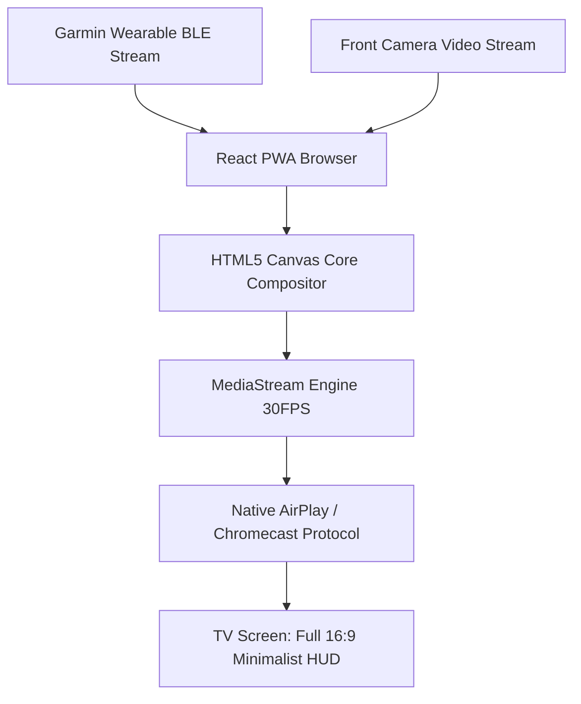
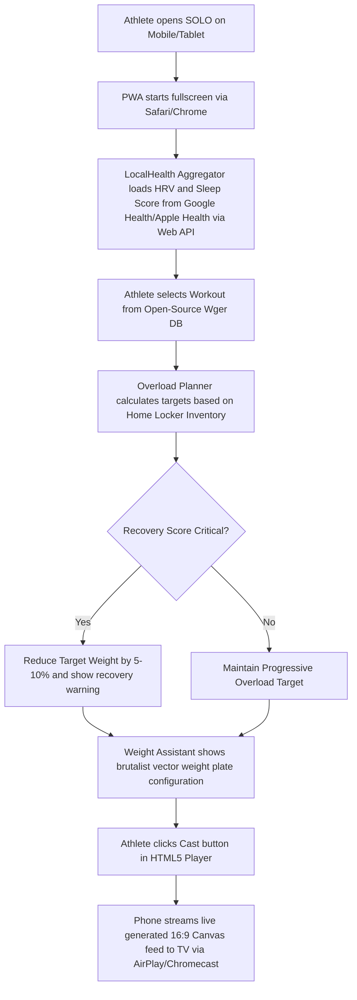
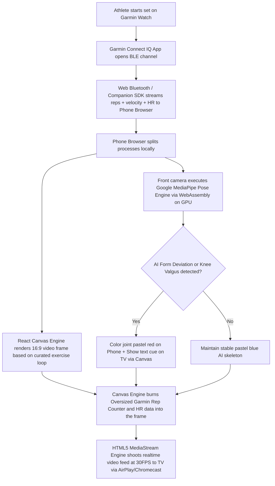
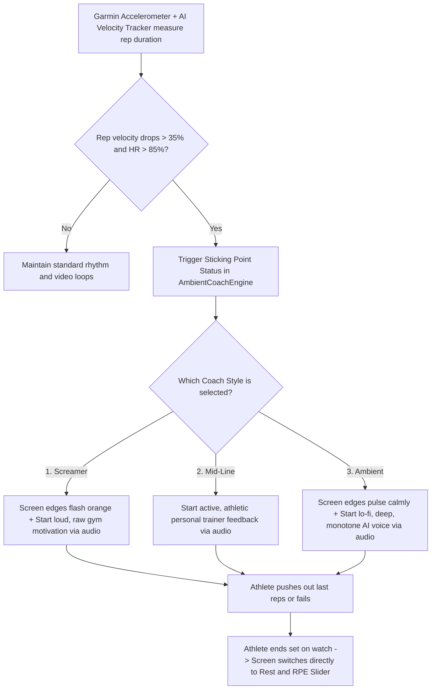
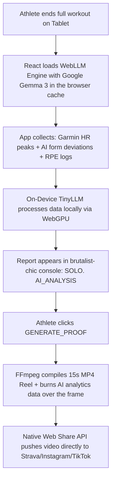

# SOLO.

> **Solo training. Zero noise.**

SOLO. is a 100% open-source, privacy-first Progressive Web Application (PWA) designed for autonomous home workouts. By transforming your smartphone or tablet into an Edge AI workstation and syncing it live with your Garmin wearable, SOLO. supports sovereign home training without App Store approvals, cloud infrastructure costs, or subscriptions.

No cloud. No subscriptions. Just you, your iron, and zero noise.

---

## The 4 Pillars of SOLO.

1. **Physical Sovereignty (`Home Locker`)**  
   Adapts progressive overload directly to your available home equipment. If you hit your home weight ceiling, the engine shifts progression variables to biomechanical adaptations such as *Time Under Tension (TUT)*.

2. **Technological Synergy (`Garmin Live Sync`)**  
   Leverages your Garmin wearable via Bluetooth Low Energy (BLE) as an active biological sensor station. Real-time heart rate, rep counts, and velocity loss are streamed directly into your screen layout.

3. **Visual Support (`Edge AI Form Check & Studio Loops`)**  
   Splits your dashboard 50/50 during active sets. The left side uses computer vision to track your body mechanics, while the right side displays smooth, lo-fi exercise loops sourced from curated, real, licensed demonstration media — never AI-generated or AI-altered reference footage.

4. **Mental Presence (`The Ambient Coach`)**  
   An algorithmic coach triggered by biological strain. When your velocity drops by >35% and heart rate crosses 85% of your max, the local audio engine kicks in with your preferred coaching style (Screamer, Mid-Line, or Ambient).

---

## Edge AI Features (0-Euro Cloud Footprint)

To maintain absolute data privacy and keep infrastructure costs at exactly **0 euros**, all heavy lifting runs locally on the user's device using cutting-edge web technologies:

* **Real-time Computer Vision:** Powered by **Google MediaPipe Pose Landmarker WebAssembly**, rendering a thin, elegant, pastel-blue 3D skeleton over your body to detect form breakdowns (e.g., knee valgus, lumbar flexion) locally on the GPU. Form feedback is guidance, not diagnosis.
* **Velocity-Based Tracking:** Monitors the meters-per-second velocity of your dumbbells/barbell via an optimized canvas vector overlay to detect neural fatigue.
* **On-Device Analytics:** Runs a compressed **Google Gemma 3 (2B) TinyLLM** completely offline inside the browser cache via the **WebLLM Framework (WebGPU)**. Generates personalized post-workout coaching reports without sending a single byte to an external cloud server.

---

## Web-to-Cast Architecture

SOLO. bypasses the limitations of sluggish smart TV web browsers. The phone renders a 16:9 high-fidelity horizontal video composite (combining the studio loop, the AI skeleton vectors, and the oversized Garmin telemetry data) on a hidden HTML5 Canvas element.

Using native browser media capabilities (`canvas.captureStream`), the composited dashboard can be sent to a TV screen via **Apple AirPlay** or **Google Chromecast**. Latency and protocol support vary by browser and device — this is a research-gated capability, not a guaranteed product promise on day one.

---

## User Flows & Architecture

### Pre-Workout & Calibration Flow

The athlete starts the browser environment and prepares the autonomous training space in the living room.

### The Active Set, Edge AI & Live Feedback Loop

The interaction during the active training phase where the phone acts as the sensor and the TV serves as the main dashboard.

### In-Set Biofeedback, AI Velocity & Mental Coach Matrix

The live algorithm that drives the mental support style and detects fatigue.

### Post-Workout & On-Device TinyLLM Analytics Flow

The evaluation phase immediately following the workout where a local language model generates a report without internet access.

---

## Open-Source Tech Stack

* **Frontend Framework:** React 19, Vite, TypeScript
* **AI Computer Vision:** Google MediaPipe Web Tasks API (Wasm)
* **Local LLM Infrastructure:** WebLLM (ONNX Runtime, WebGPU)
* **Video Composite Engine:** HTML5 Canvas API
* **Local Storage & State:** IndexedDB / RxDB (Local-First Design)
* **Hardware Interfacing:** Web Bluetooth API / Garmin Connect IQ Mobile SDK
* **External Exercise Data:** Wger REST API & `free-exercise-db` GitHub CDN
* **Media Export:** FFmpeg WebAssembly Port & Web Share API

---

## License

MIT. See `LICENSE`.

---

*Built for the sovereign home athlete. Powered by the open-source community.*
