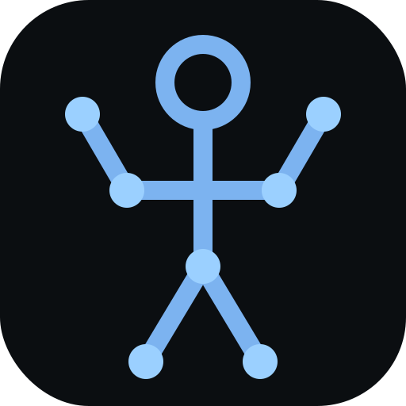

<p align="center">
  
</p>

<h1 align="center">SOLO.</h1>

<p align="center">
  <strong>Solo training. Zero noise.</strong><br/>
  Privacy-first home workouts — your phone controls the session, your TV shows the board.
</p>

<p align="center">
  React 19 · TypeScript · Vite PWA · localStorage · BroadcastChannel TV sync · Offline-first · No account · No cloud
</p>

---

SOLO. is an open-source Progressive Web App for autonomous home training. Build workouts, match weights to your home locker, run live sessions with an optional TV dashboard, and review detailed summaries — all on-device. No subscriptions, no vendor backend.

For planned features (Garmin live sync, MediaPipe pose, WebLLM analytics, canvas cast pipeline), see **[ROADMAP.md](ROADMAP.md)**.

## The 5 Pillars of SOLO.

Five ideas guide the product. **Now** is what you can use today; **Next** is on the roadmap ([ROADMAP.md](ROADMAP.md)).

| # | Pillar | Now | Next |
|---|---|---|---|
| 1 | **Your gear, your weights** | Locker profiles, overload planner, and plate configurator match every workout to the equipment you actually own | Time-under-tension when you hit your home weight ceiling |
| 2 | **Garmin as live sensor** | BLE feasibility lab (`/lab/garmin-sync`) — probe only, not in sessions yet | Live HR, reps, and velocity in the session UI and TV HUD |
| 3 | **See your form and the workout** | Camera preview on phone; exercise icons and live session board on TV (`/tv` via BroadcastChannel) | Pose form cues, licensed exercise loops, canvas compositor, cast stream |
| 4 | **Coach in your ear** | Spoken next-exercise cues, rest countdown, male/female voice | Strain-triggered coaching, style options, on-screen strain feedback |
| 5 | **Proof on your device** | Session summary, logbook, trends, and sparklines — all stored locally | WebLLM workout report, RPE logging, shareable proof reels |

Pillar-by-pillar detail: **[ROADMAP.md](ROADMAP.md)**.

## Features

- **Workouts** — create, edit, delete, and favorite templates; strength sets or circuit rounds; exercise search (Wger) with import; Garmin `.fit` import; JSON export/import
- **Home Locker** — multiple locker profiles; equipment inventory drives the overload planner and plate configurator (barbell, dumbbell, kettlebell)
- **Workout Prep** — recovery-aware target weights; prep insights per exercise; multi-workout queue; optional TV preview before start
- **Live session** — tap-to-complete exercises; set/round progression; per-exercise and phase rest timers; optional front-camera preview on phone
- **Coach** — Web Speech API announcements for next exercise and set transitions; male/female voice; rest countdown in the last 5 seconds (toggle in session)
- **TV receiver** — passive `/tv` surface synced via `BroadcastChannel`; shows session HUD, prep, summary, or idle; connect/disconnect from session with receiver handshake (reuses an already-open TV tab)
- **Exercise visuals** — lightweight icon-based visuals today; curated licensed demo loops are planned once asset licenses and attribution are verified
- **History** — completed sessions stored with full summary (set times, trends, sparklines); browse in the logbook, open, delete per entry or clear all; cancelled sessions are not recorded
- **Home** — optional Garmin recovery (settings toggle), weekly stats, resume active session
- **Themes** — automatic time-of-day themes or manual override in Settings
- **Labs** — isolated feasibility pages for Garmin BLE, pose/camera, canvas compositor, and cast stream (not part of the main session flow yet)

## Apps & Routes

| Surface | Route | Role |
|---|---|---|
| Mobile shell | `/` | Controller — home, workouts, locker, history, session |
| TV receiver | `/tv` | Passive display — open on TV or cast this tab |
| Workout prep | `/workouts/prep?ids=…` | Targets, insights, TV connect, start |
| Live session | `/session` | Active workout controller |
| Summary | `/session/summary` or `/history/:id` | Post-workout or historical recap |
| Labs | `/lab/*` | Architecture experiments |

## Tech Stack

| Layer | Choice |
|---|---|
| UI | React 19, React Router 7, Tailwind CSS 4, Lucide icons |
| Build | Vite 8, TypeScript 6, `vite-plugin-pwa` |
| State & storage | `localStorage` snapshots with stable `useSyncExternalStore` sources |
| TV transport | `BroadcastChannel` (`solo-tv-sync` + control ping/pong) |
| Coach voice | Web Speech API |
| Exercise data | [Wger API](https://wger.de) (`/exerciseinfo/`, `name__search`) |
| FIT import | `@garmin/fitsdk` |
| BLE (lab) | Web Bluetooth API — Garmin feasibility probe |

## Getting Started

```bash
npm install
npm run dev
```

Open the dev server on your phone or tablet. For TV sync during a session:

1. Go to **Workout Prep** → **Verbind TV-scherm** (or tap **TV** in an active session).
2. Open `/tv` on your TV browser (or cast that tab via AirPlay / Chromecast).
3. The controller pushes live state; disconnect with **TV ●** without closing a TV tab you opened manually.

```bash
npm run build    # production build
npm run preview  # preview dist
npm run lint     # tsc --noEmit
```

No server required — all data stays in the browser.

User flows, system diagrams, data stores, and project layout: **[ARCHITECTURE.md](ARCHITECTURE.md)**.

## License

MIT. See `LICENSE`.

---

*Built for the sovereign home athlete. Architecture in [ARCHITECTURE.md](ARCHITECTURE.md) · Future phases in [ROADMAP.md](ROADMAP.md).*
