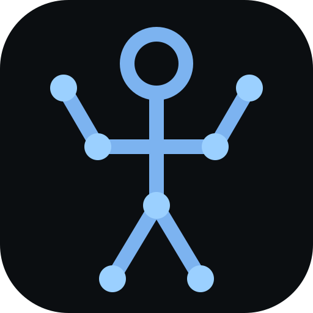

<p align="center">
  
</p>

<h1 align="center">SOLO.</h1>

<p align="center">
  <strong>SOLO Home training</strong><br/>
  Zero noise. Privacy-first workouts — your phone controls the session, your TV shows the board.
</p>

<p align="center">
  React 19 · TypeScript · Vite (phone UX reference) · Kotlin/Compose Android + Android TV planned · Offline-first · No account · No cloud
</p>

---

SOLO. (**SOLO Home training**) is an open-source home training app. The React/Vite app is the current phone UX reference; the product direction is **Kotlin/Compose on Android phone + Android TV** (see [docs/native-android-stack.md](docs/native-android-stack.md)). Build workouts, match weights to your home locker, run live sessions, and review summaries — all on-device. No subscriptions, no vendor backend.

For planned features (Connect IQ reps/velocity, MediaPipe pose, canvas cast pipeline), see **[ROADMAP.md](ROADMAP.md)**.

## The 5 Pillars of SOLO.

Five ideas guide the product. **Now** is what you can use today; **Next** is on the roadmap ([ROADMAP.md](ROADMAP.md)).

| # | Pillar | Now | Next |
|---|---|---|---|
| 1 | **Your gear, your weights** | Locker profiles, overload planner, plate configurator, and TUT when you hit your home weight ceiling | — |
| 2 | **Garmin as live sensor** | Manual recovery slider; BLE HR band in session (Chrome/Edge) | Native BLE on Android; Connect IQ reps/velocity; Health API recovery |
| 3 | **See your form and the workout** | Camera preview on phone with optional MediaPipe form cues; exercise icons on phone | Android TV companion HUD (Compose); licensed exercise loops |
| 4 | **Coach in your ear** | Spoken exercise cues, set-rust vs exercise-rest announcements, pause/resume, male/female voice; HR strain edge pulse + calm coach cue | Velocity-triggered coaching, style options |
| 5 | **Proof on your device** | Session summary, logbook, and ~15s proof reel from workout video clips + stats | — |

Pillar-by-pillar detail: **[ROADMAP.md](ROADMAP.md)**.

## Features

- **Workouts** — create, edit, delete, duplicate, and favorite templates; strength sets or circuit rounds; exercise search (Wger) with import from the editor; markdown **Uitleg** field with preview; Garmin `.fit` import; JSON export/import
- **Home Locker** — multiple locker profiles; equipment inventory drives the overload planner and plate configurator (barbell, dumbbell, kettlebell)
- **Workout Prep** — recovery-aware target weights; TUT progression when locker weight is maxed; prep insights per exercise; multi-workout queue; shared **Voorbereiden** header
- **Live session** — two-phase start (material setup → **Klaar — start workout**); tap-to-complete exercises; sticky active row; set/round progression; automatic per-exercise and phase rest timers; optional front-camera preview on phone with advisory MediaPipe form cues
- **Coach** — Web Speech API announcements for exercise and set transitions; **set rust** vs exercise rest cues; “get ready for next set” after phase rest; first exercise readout when starting a new set; pause/resume lines; male/female voice; rest countdown in the last 5 seconds (toggle in session)
- **Rest overlay** — Full-screen rust / set rust on phone with countdown and the upcoming exercise (name + target)
- **Exercise visuals** — lightweight icon-based visuals today; curated licensed demo loops are planned once asset licenses and attribution are verified
- **History** — completed sessions stored with full summary (set times, trends, sparklines); browse in the logbook, open, delete per entry or clear all; cancelled sessions are not recorded
- **Home** — optional recovery card with manual slider (settings toggle), weekly stats; **Sessie bezig** banner only during a live (started) session
- **Live HR** — optional BLE heart-rate band (Chrome/Edge) from Settings or session controls; BPM on phone control bar
- **Proof reel** — optional ~15s vertical MP4 from session camera clips + stats (FFmpeg in-browser); share or download
- **Themes** — automatic time-of-day themes or manual override in Settings
- **Labs** — isolated feasibility pages for Garmin BLE, pose/camera, canvas compositor, and cast stream (not part of the main session flow)
- **Android TV (planned)** — companion Compose app controlled by the phone over LAN (replaces the removed web `/tv` route)

## Apps & Routes

| Surface | Route | Role |
|---|---|---|
| Mobile shell | `/` | Phone UX — home, workouts, locker, history, session |
| Workout prep | `/workouts/prep?ids=…` | Targets, insights, start |
| Live session | `/session` | Active workout controller |
| Summary | `/session/summary` or `/history/:id` | Post-workout or historical recap |
| Labs | `/lab/*` | Architecture experiments |

## Tech Stack

| Layer | Choice |
|---|---|
| UI (reference) | React 19, React Router 7, Tailwind CSS 4, Lucide icons |
| Build | Vite 8, TypeScript 6, `vite-plugin-pwa` |
| State & storage | `localStorage` snapshots with stable `useSyncExternalStore` sources |
| Coach voice | Web Speech API (`src/lib/coach`) |
| Exercise data | [Wger API](https://wger.de) (`/exerciseinfo/`, `name__search`) |
| FIT import | `@garmin/fitsdk` |
| BLE HR | Web Bluetooth API — product HR band + Garmin lab probe (Android native BLE planned) |
| Pose / form cues | `@mediapipe/tasks-vision` Pose Landmarker (lite), local wasm + model via `postinstall` |
| Proof reel | `@ffmpeg/ffmpeg` Wasm → ~15s vertical MP4 from camera clips + stats; Web Share API |
| Android (planned) | Kotlin + Jetpack Compose phone + Android TV, `foss`/`full`, Byte-RB — [docs/native-android-stack.md](docs/native-android-stack.md) · [docs/ANDROID_DEVELOPMENT_PLAN.md](docs/ANDROID_DEVELOPMENT_PLAN.md) |

## Getting Started

```bash
npm install
npm run dev
```

Open the dev server on your phone or tablet. The web `/tv` receiver has been removed; the living-room board will ship as an **Android TV** app (see the Android development plan).

```bash
npm run build    # production build
npm run preview  # preview dist
npm run lint     # tsc --noEmit
```

No server required — all data stays in the browser.

User flows, system diagrams, data stores, and project layout: **[ARCHITECTURE.md](ARCHITECTURE.md)**.

## Privacy & security

- [PRIVACY.md](PRIVACY.md) — local-first policy (linked from F-Droid Fastlane copy)
- [SECURITY.md](SECURITY.md) — reporting + GitHub hardening
- [CHANGELOG.md](CHANGELOG.md) — Keep a Changelog + store notes

## Android / F-Droid (planned)

Kotlin + Jetpack Compose on **Android phone + Android TV** (phone controls TV on LAN). GitHub Releases + F-Droid (`foss`). **iOS dropped.** React/Vite is reference only.

- Stack research: **[docs/native-android-stack.md](docs/native-android-stack.md)**
- Release process: **[docs/RELEASING.md](docs/RELEASING.md)**
- F-Droid kit: **[metadata/FDROID_SUBMISSION.md](metadata/FDROID_SUBMISSION.md)**
- Agents: **[AGENTS.md](AGENTS.md)**

## License

MIT. See [LICENSE](LICENSE).

---

*Built for the sovereign home athlete. Architecture in [ARCHITECTURE.md](ARCHITECTURE.md) · Future phases in [ROADMAP.md](ROADMAP.md).*
