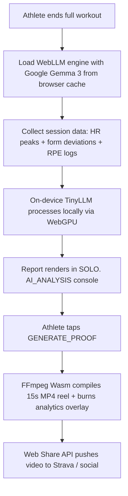

# SOLO. Roadmap

Features and architecture phases described in early design docs that are **not yet in the product app**. Labs under `/lab` are feasibility prototypes — they do not ship as part of the core session flow until promoted here and implemented.

See also the pillar overview in **[README.md](README.md#the-5-pillars-of-solo)** · implemented flows in **[ARCHITECTURE.md](ARCHITECTURE.md)**.

---

## Pillar 1 — Physical Sovereignty (Home Locker)

**Vision:** Progressive overload adapted to the equipment you actually own at home.

| Item | Status | Notes |
|---|---|---|
| Locker profiles + equipment inventory | **Shipped** | Multiple lockers; drives prep and suggestions |
| Overload planner (locker-aware weights) | **Shipped** | `[overloadPlanner.ts](src/lib/workout/overloadPlanner.ts)` |
| Recovery-aware target reduction | **Shipped** | Low recovery score reduces targets 5–10% |
| Weight Assistant / plate configurator | **Shipped** | Barbell, dumbbell, kettlebell diagrams |
| TUT progression at home weight ceiling | Planned | Shift to time-under-tension when max weight is reached |

---

## Pillar 2 — Garmin Live Sync

**Vision:** Garmin wearable as an active biological sensor (HR, reps, velocity) streamed into the session and TV HUD.

| Item                                         | Status  | Notes                                                                               |
| -------------------------------------------- | ------- | ----------------------------------------------------------------------------------- |
| Garmin BLE HR (standard 0x180D)              | Lab     | `[/lab/garmin-sync](src/pages/GarminFeasibilityPage.tsx)` — device probe only       |
| Connect IQ companion bridge (reps, velocity) | Planned | Requires native companion or CIQ data channel                                       |
| Live HR in session UI                        | Planned | Replace mock `heartRatePercentMax` in `[coachEngine.ts](src/lib/tv/coachEngine.ts)` |
| Live rep counter on TV                       | Planned | Oversized rep HUD in canvas composite                                               |
| Velocity-based fatigue detection             | Planned | >35% velocity drop trigger                                                          |

---

## Pillar 3 — Visual Support

**Vision:** Form cues on the phone, exercise visuals on the TV — a split dashboard while you train.

| Item                                              | Status  | Notes                                                               |
| ------------------------------------------------- | ------- | ------------------------------------------------------------------- |
| Front-camera access in session                    | Partial | Preview overlay on phone; no pose analysis in session yet           |
| MediaPipe Pose Landmarker (Wasm/GPU)              | Lab     | `[/lab/pose](src/pages/PoseLabPage.tsx)`                            |
| Form deviation cues (knee valgus, lumbar flexion) | Planned | Guidance only, not diagnosis                                        |
| Curated licensed exercise video loops             | Planned | Build/curate a verified CC-BY or project-owned loop library; first candidate source is Wger media where per-asset license metadata is available |
| Velocity overlay on barbell/dumbbell              | Planned | Canvas vector tracking                                              |
| 16:9 canvas compositor (loop + skeleton + HUD)    | Lab     | `[/lab/canvas-composite](src/pages/CanvasCompositeLabPage.tsx)`     |
| Passive TV receiver (`/tv`) via BroadcastChannel  | **Shipped** | Session, prep, summary, idle modes                                |
| TV connect / disconnect with receiver handshake   | **Shipped** | Ping/pong over control channel                                    |
| Cast tab to TV (AirPlay / Chromecast)             | Partial | User opens `/tv` and casts browser tab manually                     |
| `canvas.captureStream` pipeline                   | Lab     | `[/lab/cast-stream](src/pages/CastStreamLabPage.tsx)`               |
| Guaranteed low-latency cast                       | Research | Browser and device dependent — not a day-one promise               |

---

## Pillar 4 — Ambient Coach (full vision)

**Vision:** Coach triggered by biological strain with selectable coaching personalities.

| Item                                                  | Status      | Notes                                                 |
| ----------------------------------------------------- | ----------- | ----------------------------------------------------- |
| Speech announcements (next exercise, set transitions) | **Shipped** | Web Speech API; male/female voice in Settings         |
| Rest countdown voice (last 5 s)                       | **Shipped** | `[useRestCoach](src/hooks/useRestCoach.ts)`           |
| Coach style matrix (Screamer / Mid-Line / Ambient)    | Planned     | Removed from product scope; single calm coach for now |
| Strain-triggered coach (velocity drop + HR threshold) | Planned     | Depends on real sensor data                           |
| Screen edge visual feedback on strain                 | Planned     | Orange flash / calm pulse                             |

---

## Pillar 5 — On-Device Analytics & Export

**Vision:** Post-workout TinyLLM report and shareable proof reels — zero cloud.

| Item                                        | Status      | Notes                                                        |
| ------------------------------------------- | ----------- | ------------------------------------------------------------ |
| Session summary (times, trends, sparklines) | **Shipped** | `[sessionSummary.ts](src/lib/workout/sessionSummary.ts)`     |
| History with full summary replay            | **Shipped** | `[/history](src/pages/HistoryPage.tsx)`                      |
| Google Gemma 3 via WebLLM (WebGPU)          | Planned     | Offline coaching report generation                           |
| RPE slider after each set                   | Planned     | Rate of perceived exertion logging                           |
| FFmpeg Wasm — 15 s proof reel               | Planned     | Overlay analytics on video; Web Share API to Strava / social |
| AI form deviation aggregation in report     | Planned     | Depends on pose pipeline                                     |

### Planned flow — post-workout TinyLLM analytics & export

> Depends on Pillar 2 (sensor data), Pillar 3 (pose/form), and RPE logging. The shipped session summary (Pillar 5 partial) is the first step toward the full TinyLLM report.

---

## Health & Integrations

| Item                                              | Status      | Notes                                                                                 |
| ------------------------------------------------- | ----------- | ------------------------------------------------------------------------------------- |
| Recovery score from Apple Health / Health Connect | Planned     | Currently manual mock score in `[recoveryStore.ts](src/lib/storage/recoveryStore.ts)` |
| HRV and sleep score ingestion                     | Planned     | Pre-workout calibration flow                                                          |
| Strava export                                     | Planned     | Placeholder at `[/integrations](src/pages/IntegrationsPage.tsx)`                      |
| Integrations hub UI                               | Placeholder | Page exists; no connectors yet                                                        |

---

## Data & Platform

| Item                                  | Status       | Notes                                           |
| ------------------------------------- | ------------ | ----------------------------------------------- |
| localStorage snapshots (`localStore`) | **Shipped**  | Workouts, locker, session, history, coach prefs |
| IndexedDB / RxDB local-first layer    | Planned      | Mentioned in original architecture              |
| PWA install + offline shell           | **Shipped**  | `vite-plugin-pwa`                               |
| Multi-device sync                     | Out of scope | Local-only by design                            |

---

## Lab → Product promotion criteria

A lab graduates when:

1. It runs reliably in a real session (not just isolated demo page).
2. It degrades gracefully when hardware or browser APIs are unavailable.
3. It does not require cloud services or paid infrastructure.
4. UX is integrated into Workout Prep or Session — not a separate `/lab` route.

Current integrated lab slice: **Active Set Loop** (`/lab/active-set`) — end-to-end prototype; not yet merged into `/session`.

---

## Suggested phases

### Phase A — Sensors (Garmin + recovery)

- Real recovery input (manual slider UI or Health API)
- Live HR in session and on TV
- Replace mock sensor strip with BLE data

### Phase B — Vision (pose + loops)

- MediaPipe in active set
- Exercise visual assets on TV (beyond icon placeholders)
- Form cue overlay

### Phase C — Cast composite (Pillar 3)

- Promote canvas compositor from lab to optional TV mode
- Evaluate AirPlay/Chromecast latency on target devices

### Phase D — Intelligence & share (Pillar 5)

- WebLLM post-workout analysis
- RPE logging
- Proof reel export

