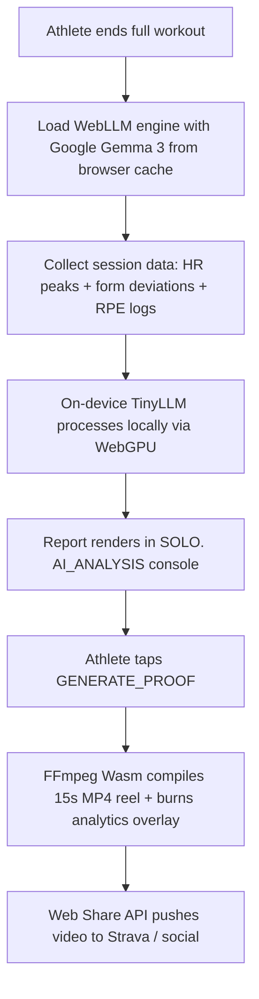

# SOLO. Roadmap

Features and architecture phases that are **not yet in the product app**, plus pillar-by-pillar **Now / Next** detail. Labs under `/lab` are feasibility prototypes — they do not ship as part of the core session flow until promoted here and integrated into Prep or Session.

**Now / Next overview:** **[README.md](README.md#the-5-pillars-of-solo)** · **Implemented flows:** **[ARCHITECTURE.md](ARCHITECTURE.md)**

---

## Pillar 1 — Your gear, your weights

**Vision:** Progressive overload adapted to the equipment you actually own at home.

| Item | Status | Notes |
|---|---|---|
| Locker profiles + equipment inventory | **Shipped** | Multiple lockers; active profile drives prep |
| Overload planner (locker-aware weights) | **Shipped** | `[overloadPlanner.ts](src/lib/workout/overloadPlanner.ts)` |
| Recovery-aware target reduction | **Shipped** | When Garmin toggle on + low recovery score, targets −5–10% |
| Weight Assistant / plate configurator | **Shipped** | Barbell, dumbbell, kettlebell diagrams |
| Prep insights (all exercises, multi-workout) | **Shipped** | `[PrepInsightsPanel](src/components/workout/PrepInsightsPanel.tsx)` |
| Multi-workout queue | **Shipped** | Select N templates → prep → sequential sessions |
| TUT progression at home weight ceiling | **Next** | Time-under-tension when max home weight is reached |

---

## Pillar 2 — Garmin as live sensor

**Vision:** Garmin wearable as an active biological sensor (HR, reps, velocity) streamed into the session and TV HUD.

| Item | Status | Notes |
|---|---|---|
| Garmin connected toggle (settings) | **Shipped** | `[garminStore.ts](src/lib/storage/garminStore.ts)` — gates recovery UI |
| Recovery card on Home | **Shipped** | Shown only when Garmin toggle on; score still manual mock |
| Recovery in prep insights + TV strip | **Shipped** | Hidden when Garmin toggle off |
| Garmin BLE HR (standard 0x180D) | Lab | `[/lab/garmin-sync](src/pages/GarminFeasibilityPage.tsx)` — device probe only |
| Connect IQ companion bridge (reps, velocity) | **Next** | Requires native companion or CIQ data channel |
| Live HR in session UI | **Next** | Replace mock `heartRatePercentMax` in `[coachEngine.ts](src/lib/tv/coachEngine.ts)` |
| Live rep counter on TV | **Next** | Oversized rep HUD in canvas composite |
| Velocity-based fatigue detection | **Next** | >35% velocity drop trigger |

---

## Pillar 3 — See your form and the workout

**Vision:** Form cues on the phone, exercise visuals on the TV — a split dashboard while you train.

| Item | Status | Notes |
|---|---|---|
| Passive TV receiver (`/tv`) via BroadcastChannel | **Shipped** | Session, prep, summary, idle modes |
| TV connect / disconnect with receiver handshake | **Shipped** | Ping/pong over control channel |
| Exercise icons + gradient visuals on TV | **Shipped** | `[exerciseMedia.ts](src/lib/tv/exerciseMedia.ts)` |
| Exercise info modal on phone (prep + session) | **Shipped** | `[ExerciseVisualMobile](src/components/workout/ExerciseVisualMobile.tsx)` — same asset logic as TV |
| Front-camera preview in session | **Shipped** | Toggle in session; preference in `[sessionUiStore](src/lib/storage/sessionUiStore.ts)` |
| Cast tab to TV (AirPlay / Chromecast) | Partial | User opens `/tv` and casts browser tab manually |
| MediaPipe Pose Landmarker (Wasm/GPU) | Lab | `[/lab/pose](src/pages/PoseLabPage.tsx)` |
| Form deviation cues (knee valgus, lumbar flexion) | **Next** | Guidance only, not diagnosis |
| Curated licensed exercise video loops | **Next** | Verify CC-BY / project-owned assets; Wger media where license metadata allows |
| Velocity overlay on barbell/dumbbell | **Next** | Canvas vector tracking |
| 16:9 canvas compositor (loop + skeleton + HUD) | Lab | `[/lab/canvas-composite](src/pages/CanvasCompositeLabPage.tsx)` |
| `canvas.captureStream` pipeline | Lab | `[/lab/cast-stream](src/pages/CastStreamLabPage.tsx)` |
| Guaranteed low-latency cast | Research | Browser and device dependent |

---

## Pillar 4 — Coach in your ear

**Vision:** Spoken guidance during the set; later, strain-triggered coaching with style options.

| Item | Status | Notes |
|---|---|---|
| Speech announcements (next exercise, set transitions) | **Shipped** | Web Speech API; male/female voice in Settings |
| Rest countdown voice (last 5 s) | **Shipped** | `[useRestCoach](src/hooks/useRestCoach.ts)` |
| Coach style matrix (Screamer / Mid-Line / Ambient) | Out of scope | Single calm coach for now |
| Strain-triggered coach (velocity drop + HR threshold) | **Next** | Depends on Pillar 2 sensor data |
| Screen edge visual feedback on strain | **Next** | Orange flash / calm pulse |

---

## Pillar 5 — Proof on your device

**Vision:** Post-workout analytics and shareable proof reels — zero cloud.

| Item | Status | Notes |
|---|---|---|
| Session summary (times, trends, sparklines) | **Shipped** | `[sessionSummary.ts](src/lib/workout/sessionSummary.ts)` |
| Logboek with full summary replay | **Shipped** | `[/history](src/pages/HistoryPage.tsx)` — nav label **Logboek** |
| Home weekly stats + recent sessions | **Shipped** | Resume active session card when live |
| Google Gemma 3 via WebLLM (WebGPU) | **Next** | Offline coaching report generation |
| RPE slider after each set | **Next** | Rate of perceived exertion logging |
| FFmpeg Wasm — 15 s proof reel | **Next** | Overlay analytics; Web Share API |
| AI form deviation aggregation in report | **Next** | Depends on pose pipeline |

### Planned flow — post-workout TinyLLM analytics & export

> Depends on Pillar 2 (sensor data), Pillar 3 (pose/form), and RPE logging. The shipped session summary is the first step toward the full TinyLLM report.

---

## Health & integrations

| Item | Status | Notes |
|---|---|---|
| Recovery score from Apple Health / Health Connect | **Next** | Currently manual mock in `[recoveryStore.ts](src/lib/storage/recoveryStore.ts)` |
| HRV and sleep score ingestion | **Next** | Pre-workout calibration flow |
| Strava export | **Next** | Placeholder at `[/integrations](src/pages/IntegrationsPage.tsx)` |
| Integrations hub UI | Placeholder | Page exists; no connectors yet |

---

## Data & platform

| Item | Status | Notes |
|---|---|---|
| localStorage snapshots (`localStore`) | **Shipped** | Workouts, locker, session, history, coach, Garmin toggle, camera pref |
| Bottom nav center action state machine | **Shipped** | `[centerNavState.ts](src/components/layout/centerNavState.ts)` |
| Global workout multi-select | **Shipped** | `[useWorkoutSelection.ts](src/hooks/useWorkoutSelection.ts)` |
| Session setup phase (materials checklist) | **Shipped** | Before `exercisesStarted`; center nav stays **Voorbereiden** |
| PWA install + offline shell | **Shipped** | `vite-plugin-pwa` |
| IndexedDB / RxDB local-first layer | **Next** | Mentioned in original architecture |
| Multi-device sync | Out of scope | Local-only by design |

---

## Lab → product promotion criteria

A lab graduates when:

1. It runs reliably in a real session (not just isolated demo page).
2. It degrades gracefully when hardware or browser APIs are unavailable.
3. It does not require cloud services or paid infrastructure.
4. UX is integrated into Workout Prep or Session — not a separate `/lab` route.

Current integrated lab slice: **Active Set Loop** (`/lab/active-set`) — end-to-end prototype; not yet merged into `/session`.

---

## Suggested phases

### Phase A — Sensors (Garmin + recovery)

- Real recovery input (Health API or manual slider UI)
- Live HR in session and on TV
- Replace mock sensor strip with BLE data

### Phase B — Vision (pose + loops)

- MediaPipe in active set
- Licensed exercise loops on TV (beyond icon placeholders)
- Form cue overlay

### Phase C — Cast composite (Pillar 3)

- Promote canvas compositor from lab to optional TV mode
- Evaluate AirPlay/Chromecast latency on target devices

### Phase D — Intelligence & share (Pillar 5)

- WebLLM post-workout analysis
- RPE logging
- Proof reel export
