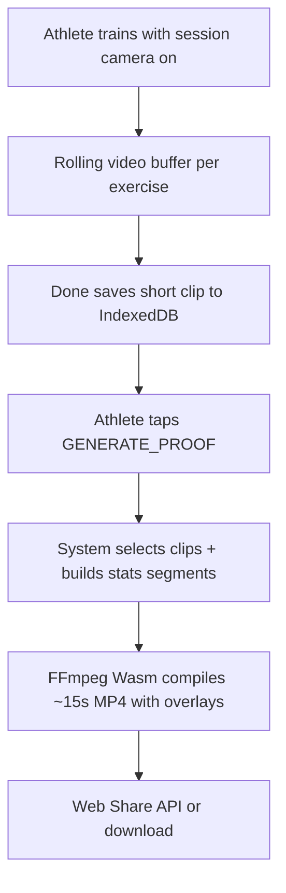

# SOLO. Roadmap

Features and architecture phases that are **not yet in the product app**, plus pillar-by-pillar **Now / Next** detail. Labs under `/lab` are feasibility prototypes — they do not ship as part of the core session flow until promoted here and integrated into Prep or Session.

**Now / Next overview:** **[README.md](README.md#the-5-pillars-of-solo)** · **Implemented flows:** **[ARCHITECTURE.md](ARCHITECTURE.md)**

---

## Pillar 1 — Your gear, your weights

**Vision:** Progressive overload adapted to the equipment you actually own at home.

| Item | Status | Notes |
|---|---|---|
| Locker profiles + equipment inventory | **Shipped** | Multiple lockers; active profile drives prep |
| Overload planner (locker-aware weights) | **Shipped** | `[overloadPlanner.ts](src/lib/workout/overloadPlanner.ts)` |
| Recovery-aware target reduction | **Shipped** | When Garmin toggle on + low recovery score, targets −5–10% |
| Weight Assistant / plate configurator | **Shipped** | Barbell, dumbbell, kettlebell diagrams |
| Prep insights (all exercises, multi-workout) | **Shipped** | `[PrepInsightsPanel](src/components/workout/PrepInsightsPanel.tsx)` |
| Multi-workout queue | **Shipped** | Select N templates → prep → sequential sessions |
| TUT progression at home weight ceiling | **Shipped** | When locker max is reached, overload planner adds TUT (+5–12s) in prep/session |

---

## Pillar 2 — Garmin as live sensor

**Vision:** Garmin wearable as an active biological sensor (HR, reps, velocity) streamed into the session and TV HUD.

| Item | Status | Notes |
|---|---|---|
| Garmin connected toggle (settings) | **Shipped** | `[garminStore.ts](src/lib/storage/garminStore.ts)` — gates recovery UI |
| Recovery card on Home | **Shipped** | Shown only when Garmin toggle on; manual slider edits score |
| Recovery in prep insights + TV strip | **Shipped** | Hidden when Garmin toggle off; slider in prep + settings |
| Garmin BLE HR (standard 0x180D) | **Shipped** | Product path via `[hrConnection.ts](src/lib/ble/hrConnection.ts)`; lab probe remains |
| Connect IQ companion bridge (reps, velocity) | **Next** | Requires native companion or CIQ data channel |
| Live HR in session UI | **Shipped** | BLE BPM on session/prep control bar + TV strip; mock % fallback without band |
| Live rep counter on TV | **Next** | Oversized rep HUD in canvas composite |
| Velocity-based fatigue detection | **Next** | >35% velocity drop trigger |

---

## Pillar 3 — See your form and the workout

**Vision:** Form cues on the phone, exercise visuals on the TV — a split dashboard while you train.

| Item | Status | Notes |
|---|---|---|
| Passive TV receiver (`/tv`) via BroadcastChannel | **Shipped** | Session, prep, summary, idle modes |
| TV connect / disconnect with receiver handshake | **Shipped** | Ping/pong over control channel |
| Exercise icons + gradient visuals on TV | **Shipped** | `[exerciseMedia.ts](src/lib/tv/exerciseMedia.ts)` |
| Exercise info modal on phone (prep + session) | **Shipped** | `[ExerciseVisualMobile](src/components/workout/ExerciseVisualMobile.tsx)` — same asset logic as TV |
| Front-camera preview in session | **Shipped** | Toggle in session; preference in `[sessionUiStore](src/lib/storage/sessionUiStore.ts)` |
| Cast tab to TV (AirPlay / Chromecast) | Partial | User opens `/tv` and casts browser tab manually |
| MediaPipe Pose Landmarker (Wasm/GPU) | **Shipped** | Session camera preview + `/lab/pose`; lite model via `[poseEngine.ts](src/lib/pose/poseEngine.ts)` |
| Form deviation cues (knee valgus, lumbar flexion) | **Shipped** | Advisory cues in camera preview; toggleable; not diagnosis |
| Curated licensed exercise video loops | **Next** | Verify CC-BY / project-owned assets; Wger media where license metadata allows |
| Velocity overlay on barbell/dumbbell | **Next** | Canvas vector tracking |
| 16:9 canvas compositor (loop + skeleton + HUD) | Lab | `[/lab/canvas-composite](src/pages/CanvasCompositeLabPage.tsx)` |
| `canvas.captureStream` pipeline | Lab | `[/lab/cast-stream](src/pages/CastStreamLabPage.tsx)` |
| Guaranteed low-latency cast | Research | Browser and device dependent |

---

## Pillar 4 — Coach in your ear

**Vision:** Spoken guidance during the set; later, strain-triggered coaching with style options.

| Item | Status | Notes |
|---|---|---|
| Speech announcements (next exercise, set transitions) | **Shipped** | Web Speech API; male/female voice in Settings |
| Rest countdown voice (last 5 s) | **Shipped** | `[useRestCoach](src/hooks/useRestCoach.ts)` |
| Coach style matrix (Screamer / Mid-Line / Ambient) | Out of scope | Single calm coach for now |
| Strain-triggered coach (velocity drop + HR threshold) | Partial | Live HR ≥85% max triggers calm coach line (90s cooldown); velocity still needs Connect IQ |
| Screen edge visual feedback on strain | **Shipped** | Warn edge pulse on phone session + TV when HR strain is active |

---

## Pillar 5 — Proof on your device

**Vision:** Post-workout analytics and shareable proof reels — zero cloud.

| Item | Status | Notes |
|---|---|---|
| Session summary (times, trends, sparklines) | **Shipped** | `[sessionSummary.ts](src/lib/workout/sessionSummary.ts)` |
| Logboek with full summary replay | **Shipped** | `[/history](src/pages/HistoryPage.tsx)` — nav label **Logboek** |
| Home weekly stats + recent sessions | **Shipped** | Resume active session card when live |
| Google Gemma 3 via WebLLM (WebGPU) | **Removed** | Dropped from product UX (did not add enough value) |
| RPE slider after each set | **Removed** | Dropped from product UX (did not add enough value) |
| FFmpeg Wasm — 15 s proof reel | **Shipped** | Session camera records short clips per exercise; reel selects clips + burns stats overlays |
| AI form deviation aggregation in report | **Next** | Depends on pose pipeline |

### Planned flow — proof reel export

```mermaid
graph TD
  A[Athlete trains with session camera on] --> B[Rolling video buffer per exercise]
  B --> C[Done saves short clip to IndexedDB]
  C --> D[Athlete taps GENERATE_PROOF]
  D --> E[System selects clips + builds stats segments]
  E --> F[FFmpeg Wasm compiles ~15s MP4 with overlays]
  F --> G[Web Share API or download]
```

> Depends on Pillar 3 (camera). Older history without clips still exports a stats-only reel.

---

## Health & integrations

| Item | Status | Notes |
|---|---|---|
| Recovery score from Apple Health / Health Connect | **Next** | Manual slider shipped in `[recoveryStore.ts](src/lib/storage/recoveryStore.ts)` |
| HRV and sleep score ingestion | **Next** | Pre-workout calibration flow |
| Strava export | **Next** | Placeholder at `[/integrations](src/pages/IntegrationsPage.tsx)` |
| Integrations hub UI | Placeholder | Page exists; no connectors yet |

---

## Data & platform

| Item | Status | Notes |
|---|---|---|
| localStorage snapshots (`localStore`) | **Shipped** | Workouts, locker, session, history, coach, Garmin toggle, camera pref |
| Bottom nav center action state machine | **Shipped** | `[centerNavState.ts](src/components/layout/centerNavState.ts)` |
| Global workout multi-select | **Shipped** | `[useWorkoutSelection.ts](src/hooks/useWorkoutSelection.ts)` |
| Session setup phase (materials checklist) | **Shipped** | Before `exercisesStarted`; center nav stays **Voorbereiden** |
| PWA install + offline shell | **Shipped** | `vite-plugin-pwa` |
| Multi-language UI + exercise content (EN default; NL/DE/FR) | **Shipped** | `i18next` catalogs, Settings language picker, locale-aware Wger MT + re-resolve on switch — [docs/i18n.md](docs/i18n.md) |
| IndexedDB / RxDB local-first layer | **Next** | Mentioned in original architecture |
| Multi-device sync | Out of scope | Local-only by design |

---

## Lab → product promotion criteria

A lab graduates when:

1. It runs reliably in a real session (not just isolated demo page).
2. It degrades gracefully when hardware or browser APIs are unavailable.
3. It does not require cloud services or paid infrastructure.
4. UX is integrated into Workout Prep or Session — not a separate `/lab` route.

Current integrated lab slices:

- **BLE HR** — graduated to product via `[hrConnection.ts](src/lib/ble/hrConnection.ts)`
- **Pose form cues** — graduated to session camera preview via `[poseEngine.ts](src/lib/pose/poseEngine.ts)`; `/lab/pose` remains a diagnostic
- **Active Set Loop** (`/lab/active-set`) — end-to-end storyboard; not yet a single merged pipeline

---

## Suggested phases

### Phase A — Sensors (Garmin + recovery)

- [x] Manual recovery slider (Home / Settings / Prep)
- [x] Live BLE HR in session control bar and on TV
- [x] Sensor strip prefers live BPM (mock % fallback; velocity still mock)
- [ ] Health API recovery ingestion (Apple Health / Health Connect)

### Phase B — Vision (pose + loops)

- [x] MediaPipe in session camera preview (lite model, graceful degrade)
- [x] Form cue overlay (knee valgus + forward collapse; advisory)
- Licensed exercise loops on TV (beyond icon placeholders)

### Phase C — Cast composite (Pillar 3)

- Promote canvas compositor from lab to optional TV mode
- Evaluate AirPlay/Chromecast latency on target devices

### Phase D — Intelligence & share (Pillar 5)

- [x] Proof reel export (FFmpeg Wasm, ~15s video clips + stats)
- [ ] Optional form-deviation insights in summary (depends on pose pipeline)

### Phase E — Multi-language

See **[docs/i18n.md](docs/i18n.md)** and **[docs/i18n-plan.md](docs/i18n-plan.md)**.

- [x] Locale foundation (`i18next`, `solo-locale`, Settings switcher; EN default)
- [x] Exercise translation service: target app locale; `descriptionByLocale` + re-resolve on switch
- [x] UI string extraction (nav, session/prep, settings, Wger, coach/TTS, locker, home, history, themes, TV, labs hub, workout editor)
- [x] Contribution path for future locales (`registry.ts` + JSON catalogs)
- [x] Labs stay English-only (hub + lab pages; not localized)
