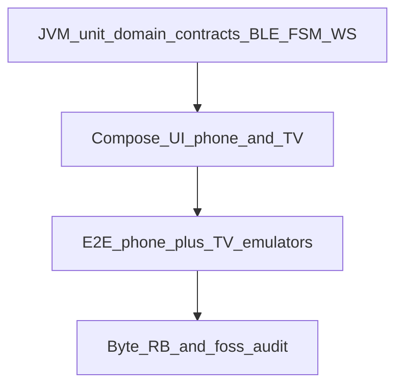

# SOLO Home training — Android development plan

Implementation plan derived from [native-android-stack.md](native-android-stack.md).

**Scope:** Kotlin/Compose **phone** + **Android TV** companion, F-Droid/`foss` + GitHub, **Byte-RB required**.

**Out of scope:** iOS, Capacitor, Play Store, Cast in `foss`, browser/web TV of any kind.

Related: [RELEASING.md](RELEASING.md) · [metadata/FDROID_SUBMISSION.md](../metadata/FDROID_SUBMISSION.md) · [AGENTS.md](../AGENTS.md)

---

## Locked product decisions

| Topic | Decision |
| --- | --- |
| Phone | Kotlin + Jetpack Compose (`net.moonbaseone.solo`) |
| TV | **Android TV Compose app only** (`net.moonbaseone.solo.tv`), phone-controlled over LAN |
| Web `/tv` | **Gone** — route, BroadcastChannel transport, and connect UX deleted from the React app |
| React/Vite | Phone UX/domain **reference only** (`src/lib/coach`, `src/lib/exercise`, session/prep flows) |
| iOS | Out of scope |
| Byte-RB | Required for every F-Droid `foss` listing |
| Flavors | `foss` (F-Droid + GitHub) / `full` (GitHub only) |

There is **no** interim browser TV path. Pairing and HUD ship only when the Android TV app exists.

---

## Goals (v1 `foss`)

1. Phone app: core flows (home, locker skim, prep, session, summary).
2. Android TV app: live HUD driven by phone (pair + WebSocket).
3. Native BLE HR (`0x180D`) with graceful degrade.
4. Dual APKs, no GMS/Cast in `foss`.
5. CI: unit + UI + E2E (phone↔TV emulators) + **Byte-RB** before F-Droid MR.

Non-goals v1: pose/proof reel, Connect IQ, Health Connect, Chromecast, any web TV surface, Cast-based living-room board.

---

## Proposals (accepted into this plan)

| # | Proposal | Status |
| --- | --- | --- |
| P1 | Vertical slices: contracts → pair → one session message on TV → grow UI | **In plan** |
| P2 | Compose TV is the only receiver; React never hosts TV again | **Done** |
| P3 | Keep web at repo root until Android skeleton exists | **In plan** |
| P4 | Contract-first goldens in `contracts/` (schema from product needs; deleted `broadcast.ts` is historical only) | **In plan** |
| P5 | Fake BLE + fake WS in CI; real BLE = release checklist | **In plan** |
| P6 | E2E: phone + Android TV emulators (Maestro preferred) | **In plan** |
| P7 | Byte-RB blocking on `v*` tags; nightly on `main` | **In plan** |
| P8 | TV listens / phone dials (pair code on TV) | **In plan** |

---

## Target layout

```text
contracts/                 # JSON Schema + golden fixtures (phone↔TV messages)
apps/android/              # phone
apps/android-tv/           # Android TV
# :contracts-kotlin :domain :transport-test
src/                       # React phone reference (no TV route or transport)
tool/fdroid_build.sh
tool/verify_reproducible.sh
```

---

## Phased delivery

Each phase = one or few PRs. **No merge without its test gate.**

### Phase 0 — Docs + web TV removal — **Done**

- Stack research + this plan: Android TV only.
- Web `/tv`, BroadcastChannel, connect UX, and `tv` i18n removed.
- AGENTS / README / ROADMAP / ARCHITECTURE aligned to phone reference + planned Android TV.

**Gate:** React lint/build green; no product path to a browser TV board.

### Phase 1 — Android skeleton + CI

- Gradle: phone + TV shells, `foss`/`full`, `LEANBACK_LAUNCHER` on TV.
- Pin JDK 21 / AGP / Kotlin; `dependenciesInfo.includeInApk = false`.
- `android-ci.yml`: unit smoke + assemble `fossDebug`.

**Gate:** assemble both apps; no GMS on `foss` classpath.

### Phase 2 — Contracts + codecs

- Author `contracts/tv-messages.schema.json` + goldens (`idle`, `prep`, `session`, `summary`, `rest`).
- Kotlin codecs + schema version; reject unknowns.
- Phone and TV both depend on the same schema module.

**Gate:** JVM encode/decode all goldens; version bump required on breaking change.

### Phase 3 — Transport + pairing (slice A)

- TV listens (WebSocket); phone dials; QR/code payload `{host,port,nonce,schemaVersion}`.
- mDNS optional later.
- Phone UX: pair sheet only (no web fallback).

**Gate:** fake-socket unit tests; emulator pair smoke E2E.

### Phase 4 — BLE HR (phone)

- `BluetoothGatt` + `BleHrClient` / `FakeBleHrClient`.
- HR samples flow into session state and (when paired) into TV messages.

**Gate:** FSM unit tests; fake GATT instrumented; manual real-band checklist before public tag.

### Phase 5 — TV HUD (slice B)

- Compose for TV modes from `TvMessage` only (idle / prep / session / rest / summary).
- Port visual intent from the old web TV mockups and phone rest/session UI — not from a live web route.

**Gate:** Compose UI tests per mode; E2E session→rest→session on TV.

### Phase 6 — Phone core UI

- Incremental: nav → workouts → locker/domain → prep → session → summary/history.
- Port domain into `:domain` with golden fixtures.
- Pair entry points in prep/session when transport exists.

**Gate:** domain unit tests per PR; phone-only E2E happy path; TV-connected path when transport exists.

### Phase 7 — Persistence + polish

- DataStore/Room; Material 3; TV focus / D-pad.

**Gate:** storage round-trip tests; define process-death policy + test.

### Phase 8 — Release + Byte-RB

- Real `fdroid_build.sh` + `verify_reproducible.sh`.
- Tag workflow: signed `foss` APKs (phone + TV) + RB compare.
- Fastlane screenshots for phone and TV; metadata for `.tv`.

**Gate:** bit-identical rebuilds (sig rules per F-Droid RB); foss audit.

### Phase 9 — F-Droid

- Only after Phase 8 green on a tag.
- Separate listings (or clear dual-APK story) for phone + TV as F-Droid policy allows.

---

## Testing strategy



| Layer | Tools | Cover |
| --- | --- | --- |
| Unit | JUnit, coroutines-test | Domain, codecs, WS framing, BLE FSM |
| UI | Compose UI Test | Session controls; TV modes from fixtures |
| E2E | Maestro (proposal) | Pairing, session→TV HUD, disconnect, phone-only |
| RB | `verify_reproducible.sh` | Tags + nightly |

### Minimum E2E scenarios

1. Pairing happy path  
2. Wrong code / schema mismatch  
3. Session drives TV (start / set complete / rest)  
4. Disconnect + reconnect  
5. Phone-only workout (TV optional)  
6. Fake HR → phone + TV strip  

### Not automated in v1

Real BLE hardware, real living-room Wi‑Fi quirks, Cast/`full`, pixel-perfect TV art.

---

## PR sequencing

| PR | Focus | Phase | Status |
| --- | --- | --- | --- |
| A | Docs + web `/tv` removal | 0 | **Done locally** — merge when ready |
| B | Android Gradle skeleton | 1 | Next |
| C | Contracts + codecs | 2 | |
| D | Pairing + WebSocket | 3 | |
| E | E2E pair smoke | 3 | |
| F | BLE + fakes | 4 | |
| G | TV HUD | 5 | |
| H… | Phone UI slices | 6 | |
| R | Signing + Byte-RB | 8 | |
| F-Droid | fdroiddata | 9 | |

---

## Immediate next step

**PR B** — empty Compose phone + TV modules, `foss`/`full` flavors, and `android-ci.yml` that assembles both `fossDebug` APKs.
