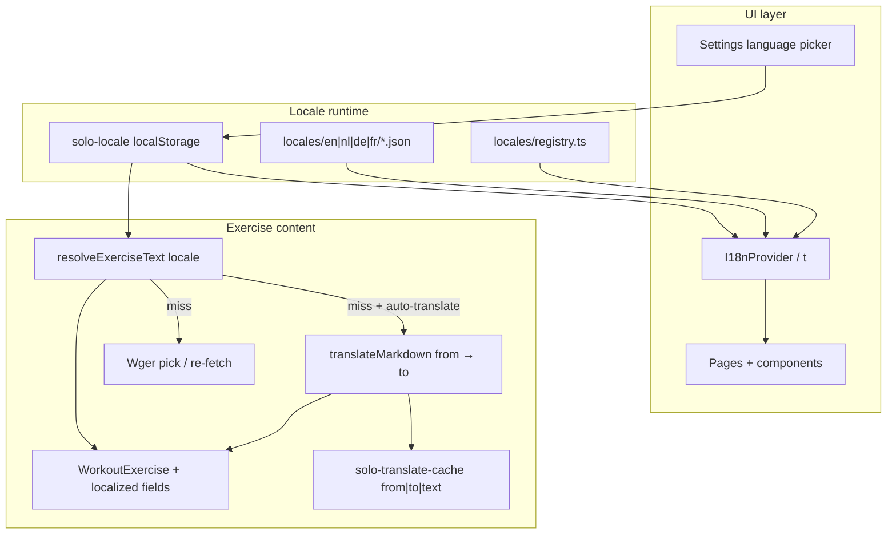

# Multi-language plan (EN default · NL · DE · FR)

Product goal: make the whole SOLO. app multi-language with **English as default**, support **Dutch, German, and French** first, keep **future language contribution easy**, and fix exercise translation so content follows the **current app language** — including when an exercise was first imported/translated under another locale.

**Today:** Vite + React SPA, offline-first (`localStorage`). UI copy is mostly hardcoded Dutch (`lang="nl"`). Exercise MT via MyMemory is hardcoded to Dutch and baked into a single `WorkoutExercise.description` string — a later language switch cannot recover another locale.

---

## Goals

| Goal | Detail |
|---|---|
| UI locale | EN / NL / DE / FR catalogs; default **English** |
| Switcher | Settings control; persist preference; update `document.documentElement.lang` |
| Contribution | Add a language by dropping a catalog + registering one locale code |
| Exercise content | Descriptions (and names when needed) resolve for the **active** locale |
| Language switch | If exercise was translated to NL, then user switches to DE/FR/EN → show or fetch that locale without losing source |
| Non-goals (v1) | Server accounts, URL-based locale routing, full RTL, translating user-typed workout names |

---

## Architecture



### Library choice

Use **`i18next` + `react-i18next`** (Vite SPA–friendly, JSON catalogs, namespaces, pluralization, easy contribution). Avoid URL locale segments for v1 (no auth/SSR; preference lives in `localStorage` like theme).

Lightweight alternative (custom `t()` + JSON) is possible but loses plurals/interpolation tooling; prefer i18next unless bundle size becomes a hard constraint.

---

## Locale contribution model (easy for future languages)

```
src/i18n/
  index.ts                 # init, setLocale, getLocale
  registry.ts              # supported locales + metadata
  types.ts                 # AppLocale union derived from registry
  hooks.ts                 # useLocale, useT wrappers if needed
  locales/
    en/
      common.json
      nav.json
      session.json
      workouts.json
      settings.json
      coach.json
      locker.json
      wger.json
    nl/ … (same namespaces)
    de/ …
    fr/ …
```

**To add a language (e.g. Spanish):**

1. Add `{ code: 'es', nativeName: 'Español', wgerId: 4, speechTags: ['es-ES', 'es'] }` to `registry.ts`.
2. Copy `locales/en/*.json` → `locales/es/` and translate.
3. Optionally map Wger language id / TTS voice scoring (already data-driven).
4. No call-site changes if keys stay stable.

**Rules:**

- English is the **source of truth** and fallback (`fallbackLng: 'en'`).
- Keys are stable English identifiers (`session.stop`, not Dutch phrases as keys).
- Missing keys fall back to EN; CI/lint can later flag missing keys.
- Namespaces split by domain so contributors translate in chunks.
- `registry.ts` is the only place that lists “supported languages” for UI, Wger priority, and speech.

---

## Phase 1 — Locale foundation

1. Add `i18next`, `react-i18next`, `i18next-browser-languagedetector` (optional; prefer explicit default EN over browser sniffing for first paint consistency — detect only if no stored preference).
2. Implement `src/i18n/` as above with EN + NL + DE + FR stubs (EN complete first; others can start as EN copies then fill).
3. `localeStore` (`solo-locale`): read/write/subscribe via existing `localStore` pattern.
4. Default: **`en`**. Migration: if no preference stored, use `en` (do **not** inherit current `html lang=nl` as default going forward).
5. Wire `I18nProvider` in app root; on locale change set `document.documentElement.lang` and keep PWA manifest note (static manifest may stay EN or follow build-time default).
6. Settings: language select (native names from registry). Keep existing “Wger auto-translate” toggle; retarget copy to “translate into app language”.

**Deliverable:** language switcher works; a few high-traffic strings prove the pipeline.

---

## Phase 2 — UI string extraction

Extract hardcoded copy into catalogs, priority order:

| Priority | Surfaces | Notes |
|---|---|---|
| P0 | `nav.ts`, `centerNavState.ts`, Settings, Home, Workouts list | Always visible |
| P0 | Session + Prep + sticky headers | Live workout UX |
| P1 | Wger browser/preview, workout builder, locker | Import + gear |
| P1 | History / summary | Post-workout |
| P2 | TV idle/session chrome (non-coach) | Receiver UI |
| P2 | Labs / about / integrations | Lower traffic |
| P2 | Themes labels, equipment `label`/`labelNl` → `t()` or per-locale map | Collapse dual labels into i18n |

**Patterns:**

- Static UI → `t('namespace.key')`.
- Dynamic templates (e.g. `Prep N`, `Live · {workout} · Set N/M`) → i18next interpolation.
- Do not translate user-authored workout/exercise names.

**Coach / TTS (bundled with Phase 2 or early Phase 3):**

- Move announcement templates from `coachEngine.ts` into `coach` namespace.
- Drive `utterance.lang` and voice scoring from locale registry (`nl-NL`, `en-US`, `de-DE`, `fr-FR`) instead of forcing Dutch.

---

## Phase 3 — Exercise translation service (multi-language + switch)

### Problem

Import currently:

1. Picks Wger translation (NL-first priority).
2. Optionally MyMemory → **Dutch only** (`translateMarkdownToDutch`).
3. Stores one `description` string.

After that, switching app language cannot show DE/FR/EN text.

### Target model

Extend `WorkoutExercise` (backward compatible):

```ts
type LocalizedText = Partial<Record<AppLocale, string>>

type WorkoutExercise = {
  // …existing fields…
  /** Legacy single description; treated as source or last-resolved. */
  description?: string
  /** Per-locale descriptions when known. */
  descriptionByLocale?: LocalizedText
  /** Original Wger (or author) text before MT. */
  sourceDescription?: string
  sourceLang?: string // ISO 639-1
  /** Per-locale display names when resolved from Wger. */
  nameByLocale?: LocalizedText
  wgerId?: string // already externalId — reuse for re-fetch
}
```

**Resolution order** for active locale `L` (used by exercise info UI, TV copy if any):

1. `descriptionByLocale[L]` if present.
2. Else native Wger translation for `L` if `externalId` known → fetch/pick → store in `descriptionByLocale[L]`.
3. Else if auto-translate on and `sourceDescription` + `sourceLang` known → MT `sourceLang → L` → cache + store in `descriptionByLocale[L]`.
4. Else fall back to `description` / EN / any available locale (stable preference: active → en → source → first available).

Keep `description` updated to the **last resolved active-locale** string for older UI paths and exports, or thin wrappers so all read paths go through `resolveExerciseDescription(exercise, locale)`.

### Import changes (`importExercise.ts`)

1. Prefer Wger translation matching **app locale** (registry `wgerId`), then EN, then other known languages (replace NL-hardcoded `WGER_DESCRIPTION_PRIORITY` with locale-aware priority).
2. Persist `sourceDescription` + `sourceLang` from the picked (pre-MT) text always when available.
3. Replace `translateMarkdownToDutch` with `translateMarkdown(text, from, to)` where `to = getLocale()`.
4. Seed `descriptionByLocale[to]` and `nameByLocale` from Wger native name for that language when present.
5. Cache keys already support any `from|to` — reuse as-is.

### Language switch after import

On locale change (or lazy on first view of an exercise in the new locale):

1. Call resolver for visible exercises (workout detail, prep, session info modal).
2. If miss → background resolve (Wger re-fetch by `externalId`, else MT from `sourceDescription`).
3. Write back into workout store so subsequent opens are instant.
4. If no `externalId` and no `sourceDescription` (legacy NL-only imports): show existing `description`, optionally offer “re-import from Wger” later — no silent wrong-language MT from Dutch-as-source unless user opts in.

### Settings copy

- Auto-translate: “When Wger text is not available in your app language, translate it and cache locally.”
- Privacy note stays: text may be sent to MyMemory when enabled.

### Wger search / display names

- Prefer `exerciseDisplayName(info, wgerLangIdFor(appLocale))`.
- Optionally pass `language__code` into search when API supports it.
- Preview should indicate which language will be stored / translated into (active locale), not “always Dutch at import”.

---

## Phase 4 — Seeds, polish, docs

1. Seed workouts: English as default content; optional `descriptionByLocale` for NL/DE/FR or keep EN-only seeds with UI chrome translated.
2. `suggestWgerWorkoutName` and similar generators → locale-aware templates or `t()`.
3. `index.html` default `lang="en"`; document contribution in `README` / short `docs/i18n.md`.
4. Update `ARCHITECTURE.md` storage table (`solo-locale`, exercise localized fields).
5. ROADMAP: mark multi-language as shipped / partial as phases land.

---

## Migration of existing user data

| Existing data | Behavior |
|---|---|
| No `solo-locale` | Default **en** |
| Exercises with only `description` (often Dutch MT) | Keep as `description`; set `sourceLang` unknown; do not assume Dutch for re-MT; resolve shows legacy string until re-import |
| Translate cache `*|nl|*` | Remains valid for NL; new targets add `*|de|*`, `*|fr|*`, `*|en|*` |
| `solo-auto-translate-wger` | Unchanged boolean; target becomes app locale |

Optional one-time heuristic (v1.1): if description looks Dutch and `externalId` exists, clear reliance on baked text and re-resolve from Wger for active locale — only if we can detect confidently; otherwise leave alone.

---

## Testing checklist

- Fresh install → UI English; Settings → NL/DE/FR updates chrome immediately.
- Missing DE key → falls back to EN.
- Import Wger exercise with DE source while app is FR → stores source + FR text (native or MT).
- Import while NL → switch app to EN → exercise info shows EN (Wger or MT), not stuck on Dutch.
- Auto-translate off → original language kept in `sourceDescription` / native locale slot.
- Offline: cached MT and catalogs work; failed MT keeps prior text.
- Coach voice language matches app locale when a matching TTS voice exists.
- `tsc` / lint clean; smoke on mobile + desktop layouts.

---

## Implementation order (when approved)

1. Phase 1 foundation + Settings switcher + 1–2 namespaces.
2. Phase 3 exercise model + resolver + import/client generalization (unblocks the stated language-switch bug early).
3. Phase 2 remaining UI + coach.
4. Phase 4 seeds/docs/polish.

Phases 1 and 3 can overlap after the registry and `getLocale()` exist.

---

## Key files to touch

| Area | Paths |
|---|---|
| New i18n | `src/i18n/**`, locale JSON trees |
| Preference | `src/lib/storage/localeStore.ts`, `SettingsPage.tsx` |
| App shell | `src/main.tsx` / root layout, `index.html` |
| Exercise MT | `src/lib/translate/client.ts`, `cache.ts`, `wgerLanguages.ts` |
| Import / Wger | `src/lib/wger/importExercise.ts`, `pickTranslation.ts`, `client.ts`, Wger UI components |
| Types / storage | `src/types/workout.ts`, workout store write paths |
| High-churn UI | `nav.ts`, `centerNavState.ts`, session/prep/TV, `coachEngine.ts`, `coachVoice.ts` |
| Docs | `ARCHITECTURE.md`, `README.md`, this plan → `docs/i18n.md` when shipped |

---

## Open decisions (defaults if implementing without further input)

| Decision | Default |
|---|---|
| Library | `i18next` + `react-i18next` |
| Default locale | `en` (explicit product change from today’s Dutch UI) |
| Browser language detection | Only when no `solo-locale` stored; still fall back to `en` if browser lang unsupported |
| Exercise re-resolve timing | Lazy on view + after locale change for loaded workout |
| Legacy Dutch-only descriptions | Show as-is; re-fetch from Wger when `externalId` present |
| Translate user workout titles | No |
