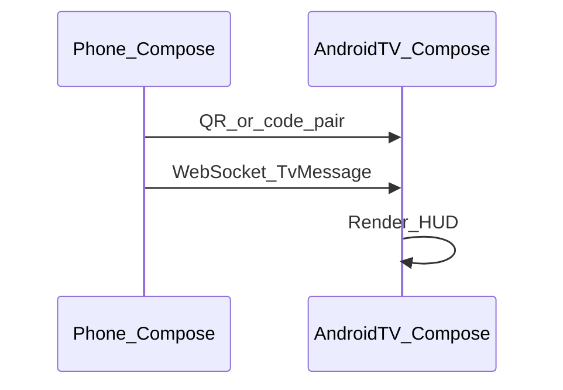

# SOLO Android-first stack

Research and decisions for phone sensors, BLE, Android TV, and F-Droid / GitHub distribution — without Play Store or App Store.

**Constraints (fixed):**

- Display / store name: **SOLO Home training** (brand mark: **SOLO.**)
- **Android-only** product — **iOS out of scope**
- **Android TV app** is the only TV surface (web `/tv` **removed**)
- Distribute via **GitHub Releases + F-Droid** (not Play)
- **Byte-RB required** for `foss`

Related: [RELEASING.md](RELEASING.md) · [ANDROID_DEVELOPMENT_PLAN.md](ANDROID_DEVELOPMENT_PLAN.md) · [metadata/FDROID_SUBMISSION.md](../metadata/FDROID_SUBMISSION.md) · [AGENTS.md](../AGENTS.md)

---

## Recommendation

**Kotlin + Jetpack Compose** for the phone app and a companion **Android TV** app, with thin shared contracts/domain.

The React/Vite tree stays as **UX/domain reference** only (not a TV host, not an iOS product).

| Surface | Stack |
| --- | --- |
| Android phone | Kotlin, Compose, native BLE, session controller |
| Android TV | Compose for TV — receiver driven by the phone over LAN |
| Web `/tv` | **Deleted** |
| iOS | Out of scope |

**Rejected:** Capacitor/WebView, React Native/Flutter for the Android product, browser-based `/tv` receiver.

### Why Compose

| | Capacitor | Kotlin + Compose |
| --- | --- | --- |
| UI | WebView | Native Material 3 / TV leanback |
| BLE | Unreliable Web BT | `BluetoothGatt` |
| F-Droid / Byte-RB | npm/wasm hostile | Gradle-only `foss` path |
| TV | Web page or Cast | Dedicated Android TV APK |

### Shared logic

Share **contracts + pure domain**, not UI:

```text
contracts/                 # versioned phone↔TV JSON
apps/android/
apps/android-tv/
# :domain Kotlin module (ported algorithms + golden fixtures)
src/                       # React reference
```

1. Freeze TV/session message schema in `contracts/`
2. Port overload/timers/HR math to Kotlin with fixtures
3. Reimplement phone screens in Compose against the same product rules

---

## Capability matrix

| Need | Legacy React (reference) | Android product |
| --- | --- | --- |
| BLE HR | Web Bluetooth (legacy) | Native BLE |
| TV board | ~~`/tv` BroadcastChannel~~ removed | Android TV app + WebSocket |
| Cast | Labs only | `full` flavor only (optional later) |
| Health Connect | Manual slider | `full` / FOSS-check later |
| Pose / proof | Wasm | Omit in `foss` v1 |
| Platform UI | Web | Compose |

---

## Flavors

```text
foss  → F-Droid + GitHub — no GMS, no Cast; native BLE; LAN phone↔TV
full  → GitHub only — may add Cast / HC / non-free SDKs
```

App ids: `net.moonbaseone.solo` + `net.moonbaseone.solo.tv`

---

## TV: Android TV only



- Two APKs, shared contracts/domain modules  
- TV listens; phone dials (pair code on TV)  
- No Chromecast required for `foss`  
- No web `/tv` fallback in product scope  

---

## F-Droid + Byte-RB

Pure Gradle Compose apps are the comfortable F-Droid path. **Byte-RB is required** before listing (stricter than Kinetic’s deferred RB).

- Pin JDK/AGP/Gradle; `SOURCE_DATE_EPOCH`; `dependenciesInfo.includeInApk = false`  
- No npm/Vite in the `foss` recipe  
- `tool/fdroid_build.sh` + `tool/verify_reproducible.sh` must pass on the tag  

Details: [ANDROID_DEVELOPMENT_PLAN.md](ANDROID_DEVELOPMENT_PLAN.md) Phase 8–9 · [RELEASING.md](RELEASING.md)

---

## Migration phases (summary)

See full gates in [ANDROID_DEVELOPMENT_PLAN.md](ANDROID_DEVELOPMENT_PLAN.md).

0. Docs + web `/tv` removal — **done**  
1. Skeleton phone + TV + CI  
2. Contracts  
3. Pairing + WebSocket  
4. BLE  
5. TV HUD  
6. Phone UI parity  
7. Persistence / polish  
8. Byte-RB + release CI  
9. F-Droid MRs  

---

## Capacitor (archived)

Evaluated and not chosen. Current direction: Compose phone + Android TV + Byte-RB.
