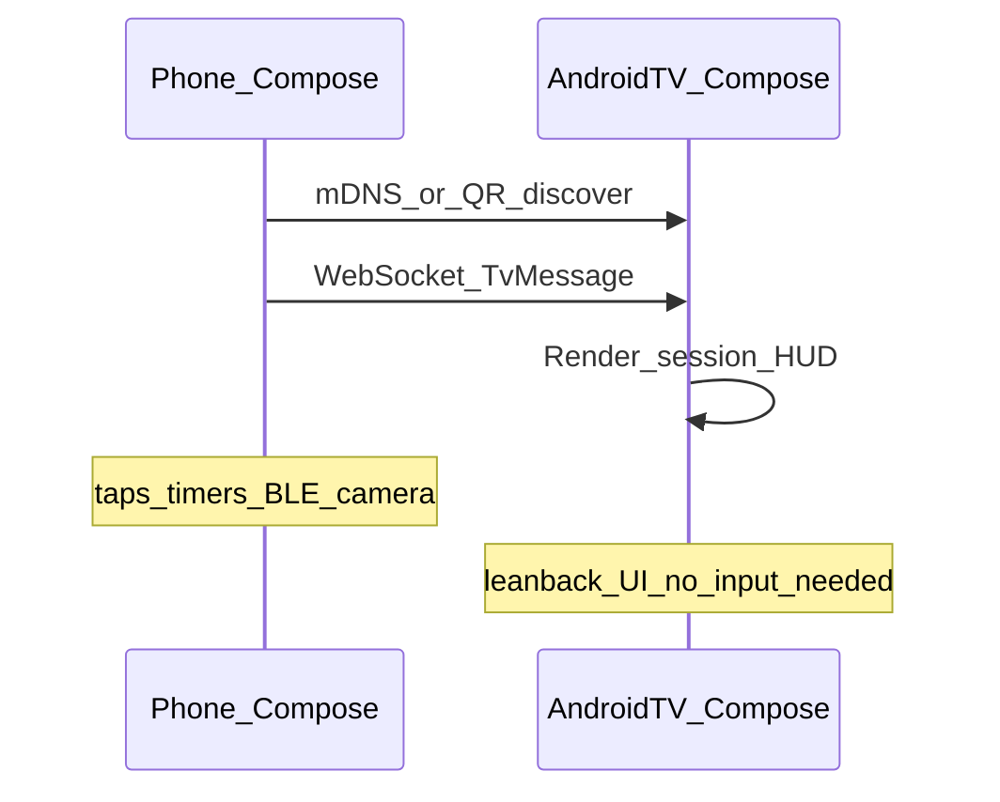

# SOLO Android-first stack

Research and decisions for phone sensors, BLE, TV, and F-Droid / GitHub distribution — without Play Store or App Store.

**Constraints (fixed):**

- Display / store name: **SOLO Home training** (brand mark: **SOLO.**)
- **Android-only** product for now — **iOS out of scope**
- Distribute Android via **GitHub Releases + F-Droid** (not Play)
- Prefer F-Droid-friendly, Gradle-native builds with **Byte-RB**

Related: [RELEASING.md](RELEASING.md) · [metadata/FDROID_SUBMISSION.md](../metadata/FDROID_SUBMISSION.md) · [AGENTS.md](../AGENTS.md)

---

## Recommendation

**Kotlin + Jetpack Compose** for the Android app, with a **thin shared-logic** layer (schemas + ported domain).

The existing **React/Vite** codebase stays in-repo as:

1. **TV asset source** — build `/tv` into the APK for LAN serving
2. **UX / domain reference** while Compose catches up
3. Optional desktop preview for maintainers — **not** a supported iOS product


| Surface                 | Stack                                                     |
| ----------------------- | --------------------------------------------------------- |
| Android phone (product) | Kotlin, Compose, native BLE, session controller           |
| Android TV (product)    | Kotlin, Compose for TV — **receiver** driven by the phone |
| Other TVs (fallback)    | Optional: serve web `/tv` on LAN for browser-only sets    |
| iOS                     | **Dropped** this phase                                    |


**Rejected for Android product:** Capacitor / WebView shell. React Native / Flutter. Maintaining an iOS PWA with broken BLE/TV hosting.

### Why Compose over Capacitor


|                    | Capacitor                        | Kotlin + Compose                                |
| ------------------ | -------------------------------- | ----------------------------------------------- |
| UI                 | Existing React in WebView        | Native Material 3 / Compose rewrite on Android  |
| BLE                | Plugin bridge; Web BT unreliable | First-class `BluetoothGatt`                     |
| F-Droid recipe     | Node + npm + Vite + Cap + Gradle | **Gradle only**                                 |
| **Byte-RB**        | Hostile (npm/wasm)               | **Required and achievable** with pinned AGP/JDK |
| MediaPipe / FFmpeg | npm wasm blobs                   | Native later or omit in `foss` v1               |
| Code reuse         | Max UI reuse                     | Domain/contracts only                           |


Compose is also chosen so we can meet **Byte-RB** without a Node-shaped APK.

### “Dunne shared logic” — concrete shape

Do **not** try to share React components. Share **contracts and pure domain**:

```text
solo/                          # monorepo (target layout)
  apps/web/                    # current Vite PWA (move or keep at root initially)
  apps/android/                # Compose app (net.moonbaseone.solo)
  packages/solo-domain/        # optional later: KMP or plain Kotlin used only by Android
  contracts/                   # JSON Schema / versioned TV + session message types
```

**Phase 1 (practical):**

1. Freeze **TV / session message schema** as versioned JSON (`contracts/tv-messages.schema.json`) — TypeScript and Kotlin both encode/decode the same shapes
2. Port critical pure functions to Kotlin as you need them on Android: overload planner, rest/timer rules, HR zone math — start by copying from `src/lib/**` with tests, not a big-bang KMP move
3. Keep PWA as source of UX truth for flows; Compose reimplements screens against the same product rules

**Phase 2 (optional):** Kotlin Multiplatform only if a second native client appears later (e.g. iOS). Not planned now.

Shared = **schemas + algorithms + golden-test fixtures**, not UI.

---


## Capability matrix


| Need           | Legacy PWA (reference)      | Android Compose (product)                           |
| -------------- | --------------------------- | --------------------------------------------------- |
| BLE HR         | Web Bluetooth (flaky)       | **Native BLE**                                      |
| Connect IQ     | Impossible                  | Garmin companion SDK (`full` if non-free)           |
| TV `/tv`       | BroadcastChannel / tab cast | Embedded HTTP serves `/tv` + WebSocket on LAN       |
| Chromecast     | N/A                         | `full` only (Play Services)                         |
| Health Connect | Manual slider               | Health Connect API (`full` / FOSS-check)            |
| Pose / proof   | MediaPipe + FFmpeg Wasm     | Native pipeline later; OK to ship `foss` v1 without |
| Platform UI    | Web                         | **Compose**                                         |


iOS: out of scope — no BLE, no TV pairing, no support commitment.

---


## Flavors

```text
foss  → F-Droid + GitHub
        no GMS, no Cast SDK, native BLE, LAN TV host
full  → GitHub only
        may add Cast, Health Connect, non-free companion SDKs
```

Application id (draft): `net.moonbaseone.solo`

---


## TV: Android TV app (preferred) + optional web fallback

**Yes — phone controls an Android TV app.** That matches SOLO’s controller/receiver model better than casting or a generic TV browser.




### How it works

1. Install **SOLO** on the phone and **SOLO TV** (or the same APK with a TV launcher activity) on Android TV / Google TV / Fire TV (if sideload allows).
2. Same Wi‑Fi. Phone discovers the TV (mDNS `_solo._tcp`, or show a pairing code/QR on the TV).
3. Phone sends the same versioned JSON session/prep/summary messages over **WebSocket** (shared contract).
4. TV app is **passive**: big type, sensor strip, rest overlay, exercise visual — D-pad optional for “disconnect” only.
5. No Chromecast, no Play Services, no browser required → ideal for `foss`.


### Packaging options


| Option                                                                         | Pros                                                  | Cons                                        |
| ------------------------------------------------------------------------------ | ----------------------------------------------------- | ------------------------------------------- |
| **Two modules, two APKs** (`net.moonbaseone.solo` + `net.moonbaseone.solo.tv`) | Clear F-Droid listings; phone users don’t need TV APK | Two releases / metadata YAMLs               |
| **One APK, two launchers** (`LEANBACK_LAUNCHER` + phone launcher)              | One artifact                                          | Larger phone install; F-Droid still one app |


**Plan default:** two modules in one repo, **two APKs**, shared `contracts` + `domain` Gradle modules. Same dual-channel release habit as Kinetic Link/Kids (two artifacts per tag).

### Web `/tv` fallback

Optional for non-Android TVs only. **Not** in the Byte-RB `foss` APK if it needs a nondeterministic Vite build — prefer Compose for TV as the product receiver.

### Capability matrix (TV row)


| Need                | Android TV app            | Web `/tv` fallback  |
| ------------------- | ------------------------- | ------------------- |
| Controlled by phone | WebSocket + pairing       | WebSocket + LAN URL |
| Native TV UI        | Compose for TV / Leanback | Browser CSS         |
| F-Droid             | First-class               | N/A (assets only)   |
| Offline LAN         | Yes                       | Yes                 |


---


## Will F-Droid take this?

**Yes — this is the comfortable path.** Pure Android Gradle apps are F-Droid’s default. No Node in the Android recipe.


| Factor               | Assessment                                                                                  |
| -------------------- | ------------------------------------------------------------------------------------------- |
| Compose / AGP        | Standard; many apps on f-droid.org                                                          |
| GMS / Cast           | Keep out of `foss`                                                                          |
| TV web assets in APK | OK if FLOSS and built in-recipe **or** committed generated assets with clear rebuild script |
| Reproducible Builds  | Still optional at first listing (Kinetic deferred too), but **reachable** later without npm |
| From-source          | `./gradlew assembleFossRelease` with pinned JDK/AGP                                         |


If `/tv` assets are produced by Vite, F-Droid either:

- runs a **documented** Node step only to build those assets (narrower than full Capacitor), or  
- you commit prebuilt `/tv` dist into `apps/android/src/main/assets/tv/` from CI with a verify script (F-Droid prefers building from source — prefer building assets in `prebuild` with pinned Node, or keep TV HTML minimal and hand-maintained).

Prefer: `prebuild` builds only `tv` entry (or whole web `npm run build`) then copies into Android assets; Gradle has no Capacitor.

---


## Migration phases

1. **Spike** — phone Compose `foss` + native BLE HR sample
2. **Contracts** — versioned TV/session JSON + WebSocket
3. **Android TV spike** — Compose for TV receiver rendering messages; phone → TV pairing on LAN
4. **Core phone screens** — home → prep → session → summary
5. **Port domain** — overload / locker / timers with shared fixtures
6. **Flavors + CI + Byte-RB** — `foss`/`full`; GitHub Actions; two APKs; `fdroid_build.sh` + `verify_reproducible.sh` must pass before F-Droid MR
7. **Optional** — web `/tv` outside RB artifacts; Cast in `full` only

**Gate:** no fdroiddata MR without a green reproducible verification for that tag.

---


## Reproducible builds (Byte-RB) — required

**Hard requirement:** GitHub Release `foss` APKs and F-Droid rebuilds must be **byte-reproducible** (same APK content; F-Droid may still re-sign / use apksigcopier). Do **not** ship the first F-Droid listing until local + CI verification passes.

This is stricter than Kinetic’s current “defer RB” stance — intentional.

### What “pass” means

1. Tag `vX.Y.Z` on `main`
2. CI builds `solo` (+ `solo.tv`) `foss` APKs with pinned toolchain
3. `./tool/fdroid_build.sh` (or fdroidserver in CI) rebuilds from that commit with the **same** recipe
4. Unsigned (or sig-stripped) APKs **match** (`diffoscope` / `apkdiff` / F-Droid verification) except for the signing block as allowed by F-Droid RB
5. Only then: publish GitHub Release **and** open/update fdroiddata with `Binaries:` / RB metadata as maintainers expect


### Make Gradle deterministic


| Control   | Practice                                                                                                                    |
| --------- | --------------------------------------------------------------------------------------------------------------------------- |
| Toolchain | Pin JDK (Temurin), AGP, Gradle wrapper, `compileSdk`, `buildTools`, Kotlin — same in CI + metadata                          |
| Time      | `SOURCE_DATE_EPOCH` from git commit; no `BuildConfig` timestamps; no “built at” strings                                     |
| AGP       | `dependenciesInfo.includeInApk = false`; avoid nondeterministic resource shrinker quirks; document R8 flags                 |
| Order     | Stable input file order; no random ZIP entry times (AGP reproducible mode / zipflinger)                                     |
| ABI       | Prefer single primary ABI artifact for RB first (`arm64-v8a`), or document per-ABI RB separately like Kinetic’s split codes |
| Secrets   | No machine-local paths in the APK                                                                                           |


### Keep Node out of the APK critical path

Vite/npm is hostile to Byte-RB. For Android TV + phone:

- **Prefer:** Compose TV UI — **no** web `/tv` inside the APK for `foss`
- Web `/tv` fallback (if any) = optional maintainer tool, not in the reproducible F-Droid artifact
- If assets must be generated: commit **verified** outputs with a lockstep hash check, or a fully pinned `SOURCE_DATE_EPOCH` Node step that is proven identical in CI and fdroid — treat as last resort


### Process gate

- [ ] `tool/verify_reproducible.sh` (to add) builds twice in clean dirs / compares to CI artifact
- [ ] fdroiddata recipe uses pinned JDK + exact commit SHA
- [ ] First listing: enable Reproducible Builds path (do **not** leave RB off “until later”)
- [ ] Release checklist in [RELEASING.md](RELEASING.md) blocks tag→F-Droid if verify fails

`AutoUpdateMode: None` can remain until automation is safe; **RB itself is not deferred**.

---


## Capacitor (archived decision)

Evaluated and **not** chosen for the Android product: max React reuse, but WebView + npm/wasm F-Droid cost + unreliable Web Bluetooth. Docs/templates may still mention it historically in git history; current direction is Compose.